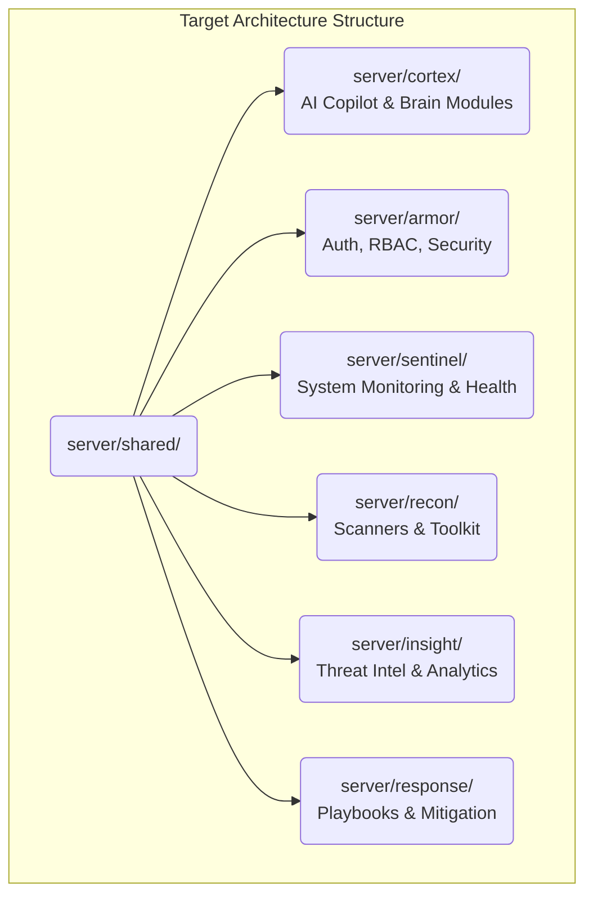

# CyberShield X - Architecture Guidelines

This document outlines the current state and the intended future target state of the CyberShield X architecture, establishing a migration strategy for long-term scalability.

## 1. Current Architecture (Version 62.2.0)

CyberShield X uses a hybrid approach, transitioning from a legacy MVC monolith to an Event-Driven Service-Oriented Architecture using Dependency Injection.

- **Legacy Core**: Standard Express MVC paradigm for business logic (`server/controllers/`, `server/services/`, `server/routes/`).
- **Modern Core (V62.2.0)**: Fully decoupled, event-driven orchestration layer located primarily in `server/services/chatbot_core/`, specialized feature folders (`server/services/intelligence/`, `server/services/datafabric/`, `server/services/automation/`, `server/services/soc/`, `server/services/observability/`, `server/services/jobs/`, `server/services/workflows/`, `server/services/scanners/`).

## 2. Core V62.2.0 Modules

- **Phase 79 Enterprise SOC Intelligence, Risk Synthesis & Analyst Decision Support Architecture**:
  - **Multi-Source Risk Synthesis Engine (`RiskSynthesisService.js`, `RiskAssessment.js`, `RiskSnapshot.js`)**:
    Evaluates evidence across 12 platform domains (Incidents, Alerts, Findings, Detections, IOCs, Assets, Threat Hunts, Governance, Compliance, Reliability, Automation, Audit). Factors expose exact weights, contributions, and source records. Empty telemetry produces truthful `UNKNOWN` and `INSUFFICIENT_EVIDENCE`.
  - **Analyst Prioritization Queue (`AnalystPriorityService.js`)**:
    Deterministic multi-factor prioritization engine ranking active Incidents, Alerts, Findings, Cases, Threat Hunts, Detection Gaps, and Assets with transparent rank explanations.
  - **Investigation Recommendations Engine (`InvestigationRecommendationService.js`, `AnalystRecommendation.js`)**:
    Safe next-best-action recommendation engine across 9 operational vectors with explicit authorization separation (`EXECUTABLE`, `APPROVAL_REQUIRED`, `MANUAL_ONLY`, `NOT_SUPPORTED`) and human feedback preservation.
  - **Campaign Activity Clustering & Attribution Guard (`CampaignClusteringService.js`)**:
    Connected-component clustering directly traversing the Phase 78 Security Data Fabric graph. Attacker attribution is strictly guarded as `UNKNOWN` without authoritative external threat feeds.
  - **Investigation Hypotheses Lifecycle (`InvestigationHypothesis.js`)**:
    Formal hypotheses tracking preserving both supporting and contradicting forensic evidence throughout the lifecycle.
  - **Machine-Readable Decision Explanations (`DecisionExplanationService.js`, `DecisionAssessment.js`)**:
    Transparent conclusion, observed facts, derived factors, uncertainty, and telemetry limitations with SHA-256 integrity content hashes.
  - **Bounded AI Decision Copilot**:
    5 advisory AI endpoints (`/summarize`, `/explain-risk`, `/prioritize`, `/suggest-investigation`, `/summarize-cluster`) wrapped in `<<<UNTRUSTED_INTELLIGENCE_DATA>>>` delimiters. Zero autonomous mutation authority.

- **Phase 78 Enterprise Security Data Fabric, Event Correlation & Unified Investigation Graph Architecture**:
  - **Canonical Graph Core (`SecurityGraphNode.js`, `SecurityGraphEdge.js`, `SecurityGraphService.js`)**:
    Materializes graph nodes and evidence-backed edges with explicit provenance tracking (`DIRECT_RECORD_REFERENCE`, `PERSISTED_FOREIGN_KEY`, `AUDIT_REFERENCE`, `EVIDENCE_REFERENCE`, `DETERMINISTIC_CORRELATION`, `TEMPORAL_ASSOCIATION`). Enforces zero synthetic relationships or invented causation.
  - **Entity Normalization Engine (`EntityNormalizationService.js`)**:
    Normalizes heterogeneous platform records across 14 domains (Identity, Asset, Vulnerability, Finding, Alert, Incident, Task, Evidence, Threat Hunt, Threat Intel, Compliance, Governance, Reliability, Automation) into standard Security Graph representations with identity deduplication.
  - **Deterministic Correlation Engine (`CorrelationService.js`, `CorrelationRule.js`, `CorrelationResult.js`)**:
    Rules-based deterministic correlation across Identity, Asset, IOC, Detection, Threat Hunt, Automation, Governance, and Reliability domains without synthetic black-box scores.
  - **Bounded Graph Query Service (`InvestigationQueryService.js`)**:
    Performs bounded graph operations including neighborhood expansion, shortest path discovery, entity-centric subgraphs, unified timeline fusion, and ATT&CK mapping with strict server-side bounds (max depth: 3, max nodes: 200, max edges: 500, timeout: 5000ms).
  - **Immutable Investigation Snapshots (`InvestigationGraphSnapshot.js`)**:
    Supports append-only investigation graph snapshots with SHA-256 integrity checksums, evidence linkage, and delta tracking across snapshots.
  - **Bounded AI Investigation Copilot**:
    4 advisory AI endpoints (`/summarize`, `/explain-relationship`, `/suggest-pivots`, `/summarize-timeline`) enclosed in `<<<UNTRUSTED_INVESTIGATION_DATA>>>` delimiters and barred from autonomous mutations.

- **Phase 77 Enterprise Security Operations Automation, Orchestration & Continuous Control Validation Architecture**:
  - **Continuous Control Validation Engine (`ControlValidationService.js`, `ControlValidation.js`)**:
    Evaluates real security controls across Governance Policies, Detection Engineering, Compliance Evidence, Reliability Signals, and Integration Metadata. Enforces zero synthetic state (`NOT_CONFIGURED`, `PASS`, `FAIL`).
  - **Security Drift Detection Engine (`DriftDetectionService.js`, `SecurityDrift.js`)**:
    Detects real configuration drift between active runtime objects and approved baseline revisions (governance policy hashes, expired credentials, reliability thresholds).
  - **Approval-Aware Remediation Engine (`RemediationService.js`)**:
    Classifies remediations into `AUTO_ALLOWED`, `APPROVAL_REQUIRED`, `MANUAL_ONLY`, `BLOCKED`, `NOT_SUPPORTED`. Enforces server-side post-action verification before granting `REMEDIATED` status.
  - **Immutable Playbook Lifecycle & Revision Engine (`PlaybookService.js`, `AutomationPlaybook.js`, `AutomationPlaybookRevision.js`)**:
    State machine (`DRAFT → REVIEW → APPROVED → ACTIVE → DISABLED → RETIRED`), append-only SHA-256 revision snapshots, and stale-approval hash validation (`approvedRevisionHash`).
  - **Idempotent Bounded Execution Engine (`AutomationExecutionEngine.js`, `AutomationExecution.js`)**:
    Mandatory idempotency keys to prevent duplicate execution of actions, step timeout bounds, concurrency limits, step evidence references, and deterministic rollback (`RemediationService.executeRollback`).
  - **Automation Recovery & Failure Handling (`AutomationRecoveryService.js`)**:
    Scans and recovers stuck or timed-out executions, handles cancellations, and computes automation success telemetry.
  - **Bounded AI Automation Copilot**:
    4 advisory AI endpoints enclosed in `<<<UNTRUSTED_AUTOMATION_DATA>>>` delimiters and barred from autonomous execution.

- **Phase 76 Enterprise Observability, Reliability, Capacity & Disaster Recovery Architecture**:
  - **Subsystem & Dependency Health Engine (`ServiceHealthService.js`, `ServiceHealthSnapshot.js`)**:
    Probes live platform subsystems (API, MongoDB, Socket.IO, Terminal Async Jobs, Reports, Threat Hunts, Tool Runtime). Strictly enforces the Permanent Constitution: Zero synthetic uptime. Telemetry-lacking services report `UNKNOWN`, `NOT_CONFIGURED`, or `BLOCKED_DEPENDENCY`.
  - **API Telemetry & Sensitive Credential Redaction (`APIObservabilityService.js`, `PlatformMetricSnapshot.js`)**:
    Intercepts requests, measures hrtime response latencies, status code distributions, and calculates rolling percentiles (p50, p95, p99). Enforces strict credential redaction scrubbing Authorization headers, cookies, API keys, passwords, and tokens.
  - **Database Diagnostics & Bounded Probes**:
    Bounded read-only Mongoose ping probes with a hard 2000ms timeout ceiling and connection pool readyState monitoring.
  - **Canonical 111-Tool Runtime Preservation**:
    Integrates runtime observations from certified capability engines while preserving the authoritative census: 102 certified working tools and 9 strictly blocked dependency tools (`sqlmap`, `trivy`, `nikto`, `aircrack-ng`, `ghidra`, `yara-rules`, `radare2`, `semgrep`, `gitleaks`).
  - **SLO / SLI Measurement & Error Budget Engine (`SLOService.js`, `SLODefinition.js`, `SLOEvaluation.js`)**:
    Evaluates sliding window objectives. Returns `NOT_MEASURED` or `INSUFFICIENT_DATA` when telemetry samples are below threshold (< 5 samples), preventing fabricated compliance percentages.
  - **Capacity & Saturation Engine (`CapacityService.js`)**:
    Inspects process memory (heapUsed/heapTotal), event loop lag, and host CPU load averages to classify system state into `NORMAL`, `WARNING`, `SATURATED`, or `UNKNOWN`.
  - **Cross-Signal Reliability Incident Correlation (`ReliabilityCorrelationService.js`)**:
    Correlates service health degradations and error spikes with concurrent SOC incidents within 15-minute windows (`CORRELATED`, `TEMPORALLY_ASSOCIATED`, `NO_CORRELATION_FOUND`) with explicit non-causal disclaimers.
  - **Disaster Recovery & Safe Isolated Restore Testing (`DisasterRecoveryService.js`, `BackupVerification.js`, `RecoveryExercise.js`)**:
    Discovers backup sources, computes cryptographic SHA-256 integrity checksums, and executes safe non-destructive restore testing inside isolated temporary sandbox namespaces (`_restore_sandbox_*`) with zero production database mutation. Manages DR exercise workflows (\`PLANNED → APPROVED → RUNNING → COMPLETED\`) recording real observed RTO and RPO in seconds.
  - **Bounded AI Reliability Copilot**:
    4 advisory AI endpoints enclosed in \`<<<UNTRUSTED_RELIABILITY_DATA>>>\` delimiters and barred from autonomous mutations.

- **Phase 75 Enterprise Multi-Tenant Governance, Policy Administration & Data Lifecycle Architecture**:
  - **Deterministic Policy Lifecycle Engine (`GovernancePolicyService.js`, `GovernancePolicy.js`)**:
    Enforces a strict state machine (`DRAFT → REVIEW → APPROVED → ACTIVE → SUSPENDED → RETIRED`, plus `REJECTED`). Every draft update or configuration change creates a new immutable revision snapshot while resetting unapproved drafts.
  - **Immutable Append-Only Revision History (`GovernancePolicyRevision.js`)**:
    Stores complete configuration snapshots with SHA-256 content hashes, author identity, and change summaries. Revisions are immutable and indexed by `{ organizationId, policyId, version }`.
  - **Critical Stale-Approval Verification**:
    Approvals cryptographically bind to the latest revision content hash (`approvedRevisionHash`). If configuration is modified after approval, the approval is invalidated and any subsequent activation attempt is definitively rejected with `STALE_APPROVAL_HASH_MISMATCH`.
  - **Bounded Data Lifecycle Engine (`DataLifecycleService.js`, `RetentionPolicy.js`)**:
    Centralizes retention governance across 11 entity types. Computes cutoff timestamps against real platform collections. Enforces a hard server-side batch limit of 500 records per execution.
  - **Legal Hold Mutation Guarding**:
    Evaluates active legal holds (`legalHoldActive`) before querying and re-checks at the mutation boundary, aborting any destructive execution to guarantee data preservation during regulatory or litigation holds.
  - **Privileged Break-Glass Emergency Access (`BreakGlassService.js`, `BreakGlassSession.js`)**:
    Provides time-bounded (5–240 min) scoped emergency access. Enforces narrow explicit capability scopes (no blanket admin role elevation), auto-expiration, action recording, and immediate revocation.
  - **Integration Credential Metadata Governance (`IntegrationCredentialMetadata.js`)**:
    Governs SIEM, SOAR, EDR, cloud, and webhook connectors, tracking SHA-256 key fingerprints, expiry timestamps, and rotation schedules without persisting raw secrets.
  - **Truthful Governance Posture & Gap Evaluation (`GovernanceEvaluationService.js`)**:
    Evaluates real platform state across 8 canonical policy domains, assigning truthful statuses (`COMPLIANT`, `PARTIAL`, `NON_COMPLIANT`, `NOT_CONFIGURED`, `INSUFFICIENT_DATA`, `NOT_MEASURED`) without fabricating compliance.
  - **Bounded AI Advisory Governance Copilot (`chatbotController.js`)**:
    Wraps untrusted governance data in `<<<UNTRUSTED_GOVERNANCE_DATA>>>` delimiters, providing advisory narratives and remediation roadmaps without autonomous mutation authority.
  - **Frontend Workstation (`GovernanceCenterPage.jsx`)**:
    Comprehensive multi-tab Governance Center mounted at `/governance` in the React frontend.
  - **Acceptance Gate**:
    `server/scripts/run_phase75_acceptance.js` passed 40/40 checks (100%) with verdict: `ENTERPRISE_GOVERNANCE_CERTIFIED`.

- **Phase 74 Enterprise SOC Reporting, Compliance Evidence, Executive Intelligence & Operational Metrics Architecture**:
  - **Versioned & Immutable Reporting Engine (`SOCReportService.js`, `SOCReport.js`)**:
    Supports 9 standardized report types (`EXECUTIVE_SUMMARY`, `SOC_OPERATIONS`, `INCIDENT_REPORT`, `CASE_DOSSIER`, `THREAT_HUNT_REPORT`, `DETECTION_COVERAGE`, `THREAT_INTELLIGENCE`, `COMPLIANCE_EVIDENCE`, `AUDIT_ACTIVITY`). Implements non-destructive versioning where generating an updated report increments the version (`v1` → `v2`) while preserving prior versions intact. Embeds a cryptographic SHA-256 content checksum ensuring post-generation immutability.
  - **Multi-Format Export Pipeline (`SOCReportService.js`, `pdfkit`)**:
    Generates structured JSON representations, flattened tabular CSV exports with normalized column headers, and real binary PDF documents formatted with `%PDF` file signatures, corporate headers, integrity checksums, and audit disclaimers.
  - **Authentic Operational Metrics Engine (`SOCMetricsService.js`, `MetricSnapshot.js`)**:
    Calculates Mean Time To Acknowledge (MTTA: `acknowledgedAt - createdAt`) and Mean Time To Resolve (MTTR: `resolvedAt - createdAt`) derived strictly from verified persisted timestamps. Discloses excluded incomplete or ongoing records transparently. Enforces a zero-fabrication guarantee: datasets lacking samples return `INSUFFICIENT_DATA`, `NO_DATA`, or `NOT_MEASURED` rather than simulated values.
  - **Real-Time SLA Governance Performance (`SOCMetricsService.js`)**:
    Tracks SLA-governed incidents against absolute target deadlines (`ON_TRACK`, `AT_RISK`, `BREACHED`) and calculates historical breach rates. Provides non-interpolated time-series trends across 24h, 7d, 30d, and 90d windows.
  - **Deterministic Executive Risk Composite (`ExecutiveRiskService.js`)**:
    Calculates a 0–100 composite risk score synthesizing open incidents (30%), active detection gaps (25%), unresolved vulnerabilities/findings (20%), SLA breaches (15%), and unverified response actions (10%). Discloses exact record citations linking high-level risk scores to underlying database artifacts.
  - **Canonical Compliance Control Framework (`ComplianceEvidenceService.js`, `ComplianceControl.js`)**:
    Seeds 9 canonical security controls across 9 modular security domains (`ACCESS_CONTROL`, `LOGGING_MONITORING`, `VULNERABILITY_MANAGEMENT`, `INCIDENT_RESPONSE`, `CHANGE_MANAGEMENT`, `ASSET_MANAGEMENT`, `DATA_PROTECTION`, `THREAT_DETECTION`, `BUSINESS_CONTINUITY`).
  - **Automated Zero-Trust Evidence Evaluation (`ComplianceEvidenceService.js`)**:
    Maps real platform records (audit events, auth logs, incidents, findings, detection rules) to controls, evaluating compliance status as `EVIDENCE_PRESENT`, `PARTIAL_EVIDENCE`, or `NO_EVIDENCE`. Truthfully discloses missing evidence without false certification.
  - **Cryptographic Evidence Packaging (`ComplianceEvidenceService.js`, `ComplianceEvidence.js`)**:
    Generates immutable, point-in-time evidence packages sealed with a cryptographic SHA-256 checksum over the raw source records. Enables zero-tamper verification for auditors.
  - **Decoupled Report Scheduling (`SOCReportService.js`, `ReportSchedule.js`)**:
    Manages automated recurring generation (`DAILY`, `WEEKLY`, `MONTHLY`, `ON_DEMAND`). Strictly separates report generation outcome (`SUCCESS`/`FAILED`) from downstream delivery outcome (`PENDING`/`SENT`/`FAILED`).
  - **Bounded AI Advisory Copilot (`chatbotController.js`)**:
    Encloses untrusted report data in prompt delimiters (`<<<UNTRUSTED_REPORT_DATA>>> ... <<<END_UNTRUSTED_REPORT_DATA>>>`). AI summaries and metric explanations are strictly advisory and explicitly barred from mutating records or certifying compliance.
  - **Workstation UIs (`ReportingCenterPage.jsx`, `ComplianceCenterPage.jsx`)**:
    Modern, responsive workstations providing executive telemetry, versioned report library, instant JSON/CSV/PDF exports, scheduled report management, 9-domain compliance matrix, and cryptographic evidence verification modals.
  - **Acceptance & Regression Gate**:
    Certified via `server/scripts/run_phase74_acceptance.js` passing 39/39 checks (100%), producing `metrics_status_v74.json`, `phase74_reporting_compliance.json`, and `docs/PHASE74_REPORTING_COMPLIANCE.md` with verdict: `SOC_REPORTING_COMPLIANCE_CERTIFIED`.

- **Phase 73 Enterprise Detection Engineering, Content Lifecycle & Threat Coverage Architecture**:
  - **Detection Content Library & Immutable Revisions (`DetectionLifecycleService.js`, `DetectionRule.js`, `DetectionRuleRevision.js`)**:
    Enforces semantic versioning and persistent `contentId` (`DET-RULE-...`) for detection logic. Every rule creation, modification, rollback, and transition generates an immutable `DetectionRuleRevision` document capturing snapshot diffs, author identity, and change justifications. Compound indexes (`organizationId`, `ruleId`) enforce strict multi-tenant scoping.
  - **Deterministic Fixture Testing & Health Engine (`DetectionTestingService.js`)**:
    Evaluates detection rules against deterministic `MATCH` and `NO_MATCH` fixtures using an isolated, non-alerting evaluation context (`detectionRuleEngine.testRule`). Dynamically manages and updates rule health status (`HEALTHY`, `NEEDS_TEST`, `FAILING_TESTS`, `EXPIRED_DEPENDENCY`, `DISABLED`). Computes persisted quality metrics and executes full-library regression suites across tenant rules.
  - **Promotion Lifecycle State Machine & Review Governance (`DetectionLifecycleService.js`)**:
    Enforces a strict promotion pipeline: `DRAFT → TESTING → REVIEW → APPROVED → ACTIVE → DISABLED / RETIRED`. Prohibits promotion from `DRAFT`/`TESTING` to `REVIEW` unless 100% of test fixtures pass. Prohibits direct activation without explicit authorized operator review and approval.
  - **Rollback Discipline (`DetectionLifecycleService.js`)**:
    Restores rules to any previously approved revision snapshot, recording the rollback as a new immutable revision (`r3`, `r4`, etc.) and logging an immutable audit event without losing intermediate history.
  - **Safe Rule Import Validation & Injection Defense (`DetectionLifecycleService.js`)**:
    Validates JSON import payloads, enforcing 7 allowed operators (`equals`, `not_equals`, `contains`, `regex`, `greater_than`, `less_than`, `in`). Prohibits dangerous MongoDB operators (`$where`, `$eval`, `$expr`, etc.), shell syntax, and process execution primitives. Imported rules start strictly in `DRAFT` status with `enabled: false`.
  - **5 Canonical Content Packs (`ContentPackService.js`, `DetectionContentPack.js`)**:
    Maintains a catalog of 5 canonical packs (`PACK-CORE-SOC`, `PACK-NETWORK`, `PACK-IDENTITY`, `PACK-ENDPOINT`, `PACK-THREAT-INTEL`) with SHA-256 integrity checksums, structural schema validation, bundled test fixtures, and organization-scoped activation.
  - **Ground-Truth MITRE ATT&CK Coverage Matrix (`DetectionCoverageService.js`)**:
    Maps 28 canonical techniques across 12 tactics. Computes truthful coverage based exclusively on active, healthy rules with passing fixtures (`COVERED`), active rules with missing/failing fixtures (`UNTESTED`), and uncovered techniques (`NOT_COVERED`).
  - **Evidence-Backed Detection Gap Engine (`DetectionGapService.js`, `DetectionGap.js`)**:
    Scans for detection gaps from uncovered techniques, unmapped security incidents, and Phase 72 post-incident reviews (PIR). Generates candidate rules strictly in `DRAFT` status with `enabled: false`.
  - **Expiring Detection Suppressions (`DetectionSuppression.js`)**:
    Provides time-bounded alert suppressions based on pattern matching with automatic expiration, preventing alert fatigue without silent data drops.
  - **Bounded AI Detection Engineering (`chatbotController.js`)**:
    3 advisory endpoints (`/review`, `/tune`, `/map-attack`) protected by strict untrusted data delimiters (`<<<UNTRUSTED_DETECTION_DATA>>> ... <<<END_UNTRUSTED_DATA>>>`) and explicit advisory notices; zero autonomous rule mutation authority.
  - **Workstation UI (`DetectionRulesPage.jsx`)**:
    Integrated Detection Engineering Center with 6 dedicated tabs: Rules Library, Revisions, Testing & Quality Metrics, Content Packs, ATT&CK Coverage Matrix, and Gap Analysis.
  - **Acceptance Gate**: Certified via `server/scripts/run_phase73_acceptance.js` passing 36/36 checks (100%), producing `detection_health_v73.json`, `phase73_detection_engineering.json`, and `docs/PHASE73_DETECTION_ENGINEERING.md` with verdict: `DETECTION_ENGINEERING_CERTIFIED`.

- **Phase 72 Full Incident Response, Case Orchestration & Evidence Lifecycle Architecture**:
  - **14-State Incident State Machine (`IncidentResponseService.js`, `Incident.js`)**:
    Enforces a strict server-side transition lifecycle: `DETECTED → TRIAGING → INVESTIGATING → CONTAINMENT_PENDING → CONTAINED → ERADICATION_PENDING → ERADICATING → RECOVERING → VALIDATION → RESOLVED → CLOSED → REOPENED` (plus terminal states `CANCELLED` and `FAILED`). Every transition is validated against a legal transition map, appends to the immutable incident timeline with actor attribution, and logs an immutable `AuditEvent`. Illegal transitions and state jumps are rejected with descriptive error contracts.
  - **Deterministic 6-Factor Incident Priority (`IncidentResponseService.js`)**:
    Computes a 0–100 deterministic priority score exposing all 6 discrete weights: Severity (30%), Criticality (20%), Exploitability (15%), Scope / Assets (15%), Asset Criticality (10%), and Threat Intel Confidence (10%). Maps scores deterministically to `INFORMATIONAL`, `LOW`, `MEDIUM`, `HIGH`, or `CRITICAL` while preserving Phase 70's explainable risk score.
  - **Real-Timestamp SLA Engine (`IncidentResponseService.js`)**:
    Calculates absolute timestamps for acknowledgement, investigation, containment, and resolution deadlines based on incident priority policies. Dynamically evaluates SLA states (`ON_TRACK`, `AT_RISK`, `BREACHED`, `COMPLETED`) using real wall-clock time comparisons without simulated countdowns.
  - **Tenant-Isolated Incident Task Subsystem (`IncidentTask.js`)**:
    Maintains incident-specific workflows supporting status states (`TODO`, `IN_PROGRESS`, `BLOCKED`, `DONE`, `CANCELLED`), task dependencies (blocking completion if prerequisites remain unresolved), checklists, due dates, assignee tracking, and audit attribution.
  - **Immutable Evidence Lifecycle & Cryptographic Verification (`EvidenceLifecycleService.js`, `EvidenceRecord.js`)**:
    Registers forensic artifacts with automatic SHA-256 hash generation, immutable raw evidence payloads, and chain of custody tracking. Implements byte-level tamper verification comparing re-hashed raw content with stored hashes, transitioning evidence between `VALID`, `TAMPER_DETECTED`, `UNAVAILABLE`, and `PENDING_VERIFICATION`. Integrates safe native tool evidence collection via `HostEnvironmentService.executeNativeTool`.
  - **Decoupled Response Action Lifecycle & Independent Verification**:
    Routes privileged actions to `PendingApproval` human gates (`AWAITING_APPROVAL → APPROVED → EXECUTING → SUCCEEDED / FAILED`). Strictly decouples execution status from remediation verification: exit code 0 marks the action `SUCCEEDED` while verification remains `UNVERIFIED`. Remediation requires independent follow-up verification (`PASS`, `FAIL`, `INCONCLUSIVE`) backed by diagnostic tool probes, hunts, or IOC checks.
  - **Mandatory Post-Incident Review (PIR) & Structured Reopening**:
    Enforces post-incident reviews for High/Critical incidents requiring root cause analysis, impact assessments, containment/eradication summaries, lessons learned, and detection gaps. Permits reopening closed incidents only when justified with valid reasons and triggering evidence references.
  - **Detection Gap Feedback Loop**:
    Transforms closed incidents into candidate `ThreatHunt` and `DetectionRule` records strictly initialized in `DRAFT` status with `enabled: false`. Prohibits automated activation.
  - **Unified Case Orchestration & Dossier Compilation (`CaseOrchestrationService.js`, `Case.js`)**:
    Serves as the operational container unifying Incidents, Threat Hunts, Tasks, Alerts, Approvals, and Evidence with parent/child case hierarchies. Compiles comprehensive case dossiers exclusively from persisted DB records with zero AI hallucination.
  - **Bounded AI Incident Copilot (`chatbotController.js`)**:
    6 dedicated copilot endpoints (`/summarize`, `/triage`, `/investigate`, `/recommend-containment`, `/draft-tasks`, `/postmortem`) protected by strict untrusted-data delimiters (`<<<UNTRUSTED_INCIDENT_DATA>>> ... <<<END_UNTRUSTED_DATA>>>`) and advisory-only guardrails with zero autonomous mutation authority.
  - **Workstation UIs**:
    - `/incidents` (`IncidentCenterPage.jsx`): Complete 8-tab Incident Command Center (Overview, Timeline, Evidence, Tasks, Response & Remediation, Threat Intel, Underlying Entities, Postmortem & Closure + Bounded AI Copilot drawer).
    - `/cases` (`CaseWorkspacePage.jsx`): Orchestration workspace with parent/child relationships, incident & hunt linking, and one-click full dossier export.
  - **Acceptance Gate**: Certified via `server/scripts/run_phase72_acceptance.js` passing 36/36 checks (100%), producing `incident_status_v72.json`, `phase72_incident_response.json`, and `docs/PHASE72_INCIDENT_RESPONSE.md` with verdict: `INCIDENT_RESPONSE_CERTIFIED`.

- **Phase 71 Threat Hunting, Threat Intelligence Fusion & Investigation Workbench Architecture**:
  - **Threat Hunting Core & AST Query Compiler (`ThreatHuntQueryEngine.js`, `ThreatHunt.js`)**:
    Compiles structured query Abstract Syntax Trees (AST) targeting 11 core forensic entities (`finding`, `alert`, `incident`, `asset`, `terminal_job`, `network_connection`, `dns_query`, `process_execution`, `file_modification`, `auth_event`, `ioc_record`) supporting 7 deterministic operators (`equals`, `not_equals`, `contains`, `regex`, `greater_than`, `less_than`, `in`). Prohibits raw query injection, sanitizes regex metacharacters, strictly bounds queries to a 30-day horizon, and caps results at 250 records.
  - **Asynchronous Hunt Lifecycle & Telemetry (`ThreatHuntExecutionService.js`, `ThreatHuntExecution.js`)**:
    Tracks individual hunt executions (`RUNNING` → `MATCHED`, `NO_MATCH`, `FAILED`) with active cancellation (`CANCELLED`), structured execution snapshots, and real-time Socket.IO broadcasts (`hunt:started`, `hunt:completed`, `hunt:failed`, `hunt:cancelled`).
  - **Canonical Templates Catalog (`ThreatHuntTemplate.js`)**:
    Pre-configured library of 7 canonical hunt scenarios (IOC Sweep, Auth Anomaly, DNS/DGA, Outbound C2, Execution Fault, Critical Vuln, Malicious Hash Sweep) with one-click cloning into active hunts.
  - **Threat Intelligence Fusion & Platform Matching (`ThreatIntelFusionService.js`, `IOCRecord.js`)**:
    Normalizes indicators across 11 formats and enriches truthfully via authentic external providers (OTX, CIRCL, DNS) without synthetic scoring. Cross-correlates indicators across Assets, Findings, Alerts, Incidents, and Terminal jobs with exact field matching.
  - **Investigation Timeline Synthesis (`InvestigationTimelineService.js`)**:
    Aggregates multi-source chronological events across hunts, alerts, findings, incidents, approvals, and terminal jobs without synthetic artifact insertion.
  - **Threat Actor & Campaign Modeling (`ThreatActorProfile.js`, `Campaign.js`)**:
    Maintains threat actor profiles and campaign tracking mapped to the MITRE ATT&CK enterprise framework with attribution states (`OBSERVED`, `REPORTED`, `ANALYST_ASSESSMENT`).
  - **Evidence Promotion & Detection Feedback Loop**:
    Analyst promotion of observed evidence to new Findings or Incidents with immutable lineage, and generation of candidate Detection Rules strictly initialized in `DRAFT` status with `enabled: false`.
  - **Bounded AI Threat Hunting Copilot (`chatbotController.js`)**:
    Hypothesis generator, query AST drafter, evidence explainer, and summarizer adhering to strict prompt injection delimiters and zero autonomous execution privileges.
  - **Workstation UIs**:
    - `/hunts` (`ThreatHuntingPage.jsx`): Visual AST query builder, execution metrics, live evidence viewer, promotion modals, template library, and AI assistant drawer.
    - `/intel` (`ThreatIntelPage.jsx`): Indicator lookup, authentic provider cards, platform matching table, actor/campaign catalog, and unified investigation timeline.
  - **Acceptance Gate**: Certified via `server/scripts/run_phase71_acceptance.js` passing 33/33 checks (100%), producing `hunt_status_v71.json`, `phase71_threat_hunting.json`, and `docs/PHASE71_THREAT_HUNTING.md`.

- **Authentication Reliability & Identity Hardening Architecture (`docs/AUTHENTICATION_ARCHITECTURE.md`)**:
  - **Single Authoritative 7-State Machine (`AuthContext.jsx`)**: Enforces strict transitions: `UNKNOWN → AUTHENTICATING → AUTHENTICATED`, `AUTHENTICATED → REFRESHING → AUTHENTICATED / SESSION_EXPIRED`, and `AUTHENTICATED → UNAUTHENTICATED`. Route guards (`PrivateRoute`, `AdminRoute` in `App.jsx`) render `<LoadingScreen />` while state is unresolved, completely eliminating premature redirect loops on page reload.
  - **Single-Flight Refresh Mutex & Lock (`api.js`)**: Serializes concurrent 401 failures into a single in-flight refresh request. Requests waiting in queue are retried with the newly minted access token attached to their headers. Enforces `originalRequest.headers['Authorization'] = 'Bearer ' + newAccessToken` on the originating request to prevent immediate secondary 401s.
  - **Dual-Transport Refresh with HTTPS-Aware Cookies (`authController.js`, `AuthService.js`)**: Accepts refresh tokens from `req.cookies?.refreshToken`, `req.body?.refreshToken`, or `req.headers['x-refresh-token']`. Applies environment-sensitive cookie options: `sameSite: 'lax'` / `secure: false` in development HTTP, and `sameSite: 'none'` / `secure: true` in production HTTPS.
  - **Database Integrity & Unique Identity Enforcement (`User.js`, `Session.js`)**: Enforces database-level uniqueness on `emailHash` (`unique: true, index: true`) to resolve race conditions caused by non-deterministic AES-256 random-IV email encryption. Removes duplicate index warnings on `Session.expiresAt`.
  - **Structured Claims & Token Governance (`jwt.js`)**: Standardizes JWT generation and verification with strict issuer (`cybershield-x`), audience (`cybershield-x-api`), 10-second clock tolerance, and explicit session binding (`sessionId`).
  - **Standardized Error Contracts (`PlatformErrors.js`, `auth.js`)**: Emits deterministic machine-readable error codes (`AUTH_INVALID_CREDENTIALS`, `AUTH_ACCOUNT_EXISTS`, `AUTH_SESSION_EXPIRED`, etc.) across all auth endpoints while maintaining backwards compatibility.
  - **Cross-Tab Session Synchronization (`AuthContext.jsx`)**: Synchronizes session invalidation across browser tabs in real time using `storage` events. Performs complete state and cache purging on logout.
  - **UI Double-Submit Protection (`LoginPage.jsx`, `SignupPage.jsx`)**: Locks submit controls while requests are in flight (`if (loading) return;`) preventing double-click state corruption.
  - **Acceptance Gate**: Certified via `server/scripts/run_authentication_reliability.js` (34/34 PASS, 100%), producing `server/scripts/authentication_health_v71.json` with verdict: `AUTHENTICATION_RELIABILITY_CERTIFIED`.

- **Phase 70 SOC Intelligence, Correlation Engine, Detection Rules & Safe Automation Architecture**:
  - **Deterministic Detection Rule Engine (`DetectionRuleEngine.js`, `DetectionRule.js`)**: Real-time condition evaluation supporting 7 deterministic operators (`equals`, `not_equals`, `contains`, `regex`, `greater_than`, `less_than`, `in`) with deep dot-notation resolution across arbitrary event payloads. Emits strictly explainable `MATCH` or `NO_MATCH` outcomes with concrete matched field evidence.
  - **Rule Approval Lifecycle & Human-in-the-Loop Governance**: Strict state progression (`DRAFT → TESTING → APPROVED → ACTIVE / DISABLED`). Machine/AI-generated rules are automatically flagged as `aiDraft: true` and locked in `DRAFT` state with `enabled: false`. Prohibits autonomous activation; requires deterministic fixture testing and explicit human analyst sign-off before entering production detection flows.
  - **Time-Bounded Suppression Engine (`DetectionSuppression.js`)**: Prevents false positive noise with mandatory operator justification, actor attribution, and required expiration (`expiresAt`). Active suppression queries dynamically filter matching signals without deleting underlying data, and automatically lapse back to active detection upon expiration with zero persistent blind spots.
  - **IOC Normalization & Truthful Enrichment Layer (`IOCNormalizationService.js`, `IOCRecord.js`)**: Canonicalizes 11 indicator formats (IPv4, IPv6, FQDNs, domains, hostnames, URLs, MD5/SHA1/SHA256 hashes, CVEs, certificate fingerprints). Adheres to absolute truthfulness: integrates with live authentic providers (DNS, CIRCL HashLookup, OTX) and explicitly records `EXTERNAL_SERVICE_UNAVAILABLE` or `NOT_FOUND` when providers are absent or unconfigured. Synthesized reputation is strictly forbidden.
  - **Incident Correlation & Explainable 5-Factor Risk Scoring (`IncidentCorrelationEngine.js`, `Incident.js`)**: Multi-event correlation clustering disparate alerts and findings by asset, IP, domain, and time window. Computes deterministic 0–100 risk scores with documented factor weights: Severity (35%), Asset Criticality (20%), Exploitability (15%), Threat Intel Confidence (15%), and Correlated Events (15%). Generates complete evidence-backed attack-chain DAGs (`Asset → Service → Vulnerability → IOC → Finding → Alert → Incident → Response`).
  - **Idempotent Alert Deduplication Engine (`Alert.js`)**: Ingests high-frequency security events idempotently. On matching fingerprints, increments `occurrenceCount`, updates `lastSeen`, and preserves immutable `firstSeen` and raw evidence artifacts without discarding historical forensic traces.
  - **Safe Playbook Automation & Approval Gate (`SafePlaybookAutomationService.js`, `PendingApproval.js`)**: Extends the orchestration pipeline with strict 3-tier capability risk classifications (`LOW_RISK`, `USER_APPROVED`, `PRIVILEGED`). Risky and privileged responses require explicit operator authorization through a managed approval lifecycle (`PROPOSED → AWAITING_APPROVAL → APPROVED → EXECUTING → COMPLETED / FAILED / DENIED`). Execution strictly routes through existing canonical channels (`HostEnvironmentService.executeNativeTool`) with zero arbitrary shell invocation.
  - **Bounded AI Detection Engineering (`chatbotController.js`)**: Provides operator copilot capabilities (explainable detection match reasoning, finding correlation, incident summarization, and candidate rule proposals) while enforcing strict prompt-injection delimiters and immutable boundaries: AI never self-authorizes, never bypasses approval gates, and never fabricates tool evidence.
  - **SOC Workstation UIs**: Modernized operator interfaces:
    - `/detections` (`DetectionRulesPage.jsx`): Rule management, search, test modal, approval status, and AI draft markers.
    - `/incidents` (`IncidentCenterPage.jsx`): Incident manager, attack-chain visualization, risk factor breakdown, and authorized state transitions.
    - `/approvals` (`ApprovalCenterPage.jsx`): Human-in-the-loop approval center inspecting requested actions, target assets, risk level, and approving/denying with recorded rationale.
    - CyberSOC Desktop (`DashboardPage.jsx`): Real-time SOC Intelligence telemetry banner and Socket.IO listener for live event stream (`detection:new`, `incident:new`, `approval:new`, `playbook:status`).
  - **Acceptance Gate**: Certified via `server/scripts/run_phase70_acceptance.js` passing 22/22 checks (100%), producing `detection_status_v70.json`, `phase70_soc_intelligence.json`, and `docs/PHASE70_SOC_INTELLIGENCE.md`.

- **Phase 69 Native Capability Expansion, Dependency Management & SOC Operations Architecture**:
  - **Native Dependency Lifecycle & Safe Remediation**: Built complete verification pipeline (`DETECT → EXPLAIN → APPROVE → CONFIGURE/INSTALL → VERIFY → REGISTER → CERTIFY`) across 111 canonical tools (`GET /api/terminal/tool-health`, `GET /api/terminal/dependencies`, `POST /api/terminal/remediate/:toolId`). Prohibits binary existence alone as capability proof; inspects real semantic versioning and platform architecture, executing safe non-shell verification probes (`spawnSync(resolvedPath, [flag], { shell: false })`). Prohibits `sh -c` and `bash -c`.
  - **Asynchronous Terminal Job Management Engine (`TerminalJobService.js`)**: Real asynchronous job dispatcher with lifecycle transitions (`QUEUED → RUNNING → COMPLETED / FAILED / TIMEOUT / CANCELLING → CANCELLED`), 512KB stdout buffer ceiling, Socket.IO broadcast (`job:status`), and strict execution ID discipline (retry creates guaranteed new `executionId`, never reusing process identities).
  - **SOC Case Management & Normalized Findings Workspace (`Case.js`, `Finding.js`, `CaseWorkspacePage.jsx`)**: Comprehensive analyst case management workspace (`/api/cases`, `/cases`) with timeline tracking and SHA-256 evidence hashing. Normalized findings (`/api/findings`) with immutable `rawEvidence` (strict prohibition against overwriting raw tool output with AI or analyst notes).
  - **Segregated Evidence Triad**: Strict separation of concerns between **Raw Observed Tool Output** (authoritative factual artifact), **Analyst Notes** (human interpretation and triage), and **AI Interpretation** (model reasoning and hypothesis).
  - **Real-Time SOC Alert Center (`Alert.js`, `AlertsPage.jsx`)**: Operational alert lifecycle (`NEW → ACKNOWLEDGED → INVESTIGATING → RESOLVED`) driven by real security events and findings, with live Socket.IO event broadcast (`alert:new`).
  - **Bounded AI Investigation Assistant (`chatbotController.js`)**: Endpoint `POST /api/chatbot/investigate` providing grounded analysis, finding correlation, and proposed next investigative steps categorized into 3 strict action levels: `ANALYSIS_ONLY` (no execution), `USER_APPROVED_TOOL_ACTION` (explicit operator confirmation gate), and `PRIVILEGED_ACTION` (admin authorization required). Zero autonomous privileged execution permitted.
  - **Granular Server-Side RBAC & Audit Logging (`rbac.js`, `auditLogger.js`, `AuditEvent.js`)**: Server-side role hierarchy (`VIEWER: 10`, `ANALYST: 20`, `OPERATOR: 30`, `ADMIN: 40`), immutable audit trail with non-blocking asynchronous persistence and recursive redaction of credentials (`password`, `token`, `secret`, `jwt`, `apiKey`, `mongoUri`).
  - **Global Multi-Entity Search (`searchController.js`, `/api/search`)**: RBAC-aware search engine querying tools, cases, findings, alerts, and jobs without leaking unauthorized entities to lower-privileged roles.
  - **Operator Workstation UI Modernization**: `HostCapabilityManagerModal.jsx` (Operator view inspecting version, architecture, and running safe verification probes), `CyberTerminalModal.jsx` (Capabilities launcher, Presets dropdown, Jobs drawer, Autocomplete overlay), `CaseWorkspacePage.jsx` (`/cases`), and `AlertsPage.jsx` (`/alerts`).
  - **Acceptance Gate**: Machine-generated verification in `server/scripts/run_phase69_acceptance.js` (20/20 checks PASS, 100%), generating `capability_status_v69.json`, `phase69_capability_expansion.json`, and `docs/PHASE69_CAPABILITY_EXPANSION.md`.

- **Phase 68 Production Deployment, Operations & Launch Certification (`run_production_readiness_v68.js`, `docs/PRODUCTION_OPERATIONS_RUNBOOK.md`)**:
  - **Operational Runbook & SOP**: Complete standard operating procedure defining system topology, prerequisites, process management (PM2, Docker), graceful shutdown, readiness probes, database failover, backups, rollbacks, and incident response.
  - **Dedicated Terminal Limiter & Emergency Exemption**: Express rate limiter mounted on `/api/terminal` (60 req/15min) returning normalized `RATE_LIMITED` code, while exempting `POST /api/terminal/cancel`, `/check-tool/:toolId`, and `/host-capabilities`.
  - **Graceful Shutdown & Zombie Elimination**: Server shutdown hook actively iterates `HostEnvironmentService.activeProcesses` and issues `SIGKILL` to prevent lingering child processes, drains connection pools, and disconnects Mongoose cleanly.
  - **Database Hardening**: Enhanced connection options with pooling (`maxPoolSize: 50`, `minPoolSize: 5`), socket timeouts (`45,000ms`), and resilient connection listeners (`reconnected`, `disconnected`, `error`).
  - **Automated Deployment Gate**: `run_production_readiness_v68.js` evaluates 22 ground-truth checks, producing machine-generated `production_deployment_readiness_v68.json` with dynamic verdict `DEPLOYMENT_READY` and environment state `ENVIRONMENT_READY`.
  - **Secret Safety Guarantee**: Zero real secrets across repository, documentation, logs, or client bundles. Sanitized template blueprints in `.env.example`.

- **Phase 67 Final Product Reality Audit Architecture (`server/scripts/run_phase67_reality_audit.js`)**:
  - **Ground-Truth Verification Engine**: Comprehensive test harness deriving canonical inventory directly from code (`toolConfig.js`), dynamically verifying real execution across all 4 targets (`HOST_NATIVE`, `CYBERSHIELD_API_ENGINE`, `CLIENT_BROWSER`, `BLOCKED_DEPENDENCY`).
  - **Full Terminal Lifecycle Verification**: Automated verification of process spawning, active map tracking (`activeProcesses`), authenticated cancellation (`SIGTERM`/`SIGKILL`), strict timeout deadlines (killing hanging commands and returning `status: TIMEOUT`), and blocked state enforcement.
  - **Zero-Simulation & Secret Leakage Inspection**: Runtime audit scanning all live API responses and production client code for simulated trend curves or credential leakage.
  - **Machine-Generated Artifacts**: Generates `server/scripts/final_product_reality_audit_v67.json` (dynamic verdict calculation based on findings) and `docs/PHASE67_FINAL_PRODUCT_AUDIT.md`.
- **Phase 66 CyberSOC Workstation UI/UX Architecture (`Layout.jsx`, `DashboardPage.jsx`, `CyberTerminalModal.jsx`)**:
  - **4-Zone Desktop Shell (`Layout.jsx`)**: Workstation Navigation Rail (OPERATIONS, ANALYSIS, SYSTEM), Top Command Bar (live readiness status `READY`/`DEGRADED`, AI attribution, `⌘K` Palette and `>_` Terminal triggers), Center Main Operational Deck, and Bottom Operational Status Bar (`DB: CONNECTED`, `READINESS`, `111 TOOLS • 102 WORKING • 9 BLOCKED`, `AI PROVIDER`, `v61.4.0`).
  - **Bento Grid Command Center (`DashboardPage.jsx`)**: 7-panel operational layout: Tactical Quick Execution Deck (real-time input, target type badges, one-click launcher chips), Live Platform Readiness & Host Telemetry (Node heap, uptime, MongoDB, Gemini AI, detected binaries), Canonical Tooling Census (111 tools), Vulnerability Donut & Posture Scoring, Recent Operations & Execution Telemetry, Real Threat Event Stream (Socket.IO `threat:new`), and Perimeter Asset Watchlist (zero fake delays/simulations).
  - **Operator Console Terminal (`CyberTerminalModal.jsx`)**: First-class security operator console with live process state badge (`IDLE`, `RUNNING`, `CANCELLING`, `CANCELLED`, `COMPLETED`, `FAILED`, `TIMEOUT`), Execution Telemetry Bar (`EXEC_ID`, `TOOL`, `TARGET`, `ELAPSED_MS`), **[Abort Execution (SIGTERM)]** cancellation button, and structured operational error messages (`DEPENDENCY_MISSING`, `SSRF_BLOCKED`, `TIMEOUT`, `CANCELLED`).
  - **Target Badges & Command Palette (`CommandPaletteModal.jsx`)**: Full taxonomy of execution targets (`[HOST_NATIVE]`, `[API_ENGINE]`, `[CLIENT_BROWSER]`, `[BLOCKED_DEPENDENCY]`) with explicit missing binary warnings and Homebrew/APT remediation guidance.
  - **AI Copilot Evidence Segregation (`SecurityCopilot.jsx`)**: Transparent model attribution (`Google Gemini 2.5 Flash`) and visual isolation of verified tool evidence (`[RAW TOOL EVIDENCE — VERIFIED]`) from conversational reasoning.
- **Phase 65 Real-World End-to-End Acceptance Architecture (`server/scripts/run_phase65_e2e_acceptance.js`)**: Production acceptance battery exercising 35 end-to-end scenarios covering the complete user lifecycle:
  - Machine-generated evidence artifacts: `server/scripts/e2e_acceptance_results_v65.json` (35/35 scenarios PASS) and `server/scripts/production_acceptance_v65.json` (5-pillar acceptance matrix: Product, Execution, Reliability, Security, Observability).
  - AI Copilot behavioral verification: Grounded context referencing real scan findings without hallucination; adversarial prompt injection resistance against untrusted scan data, direct terminal authorization hijack attempts, and system prompt/credential exfiltration attempts; model attribution transparency (`model`, `provider`, `responseMetadata`).
  - Native process lifecycle: Real binary execution (`nmap`, `dig`, `curl`, `whois`, `openssl`, `traceroute`, `ping`) without shell wrappers, authenticated user cancellation with `SIGTERM` followed by guaranteed `SIGKILL`, active Map eviction, 512KB buffer ceiling, and strict shell metacharacter and cloud-metadata SSRF blocking.
  - Zero mock outputs across 19 specialized service layers and 5 client-side browser utilities. Honest `DEPENDENCY_MISSING` reporting for 9 missing CLI tools.
- **Execution Orchestration**: `ExecutionOrchestrator`, `ExecutionDispatcher`, `ScanExecutionService`. Controls capability routing.
- **Workflow Engine**: `WorkflowExecutionService`, `WorkflowManager`. Orchestrates parallel and sequential DAGs (Feature 010).
- **Job Management**: `JobManager`, `JobScheduler`, `JobRepository`. Handles execution lifecycles and FIFO queueing.
- **Intelligence & Correlation**: `CorrelationEngine`, `FindingDeduplicator`, `RiskScoringService`. Generates unified immutable intelligence reports from disparate scanner outputs (Feature 009).
- **Storage Abstraction**: `IStorageProvider`, `MongoStorageProvider`. Persistent storage decoupling for Jobs and Workflows (Feature 011).
- **Notification Engine**: `NotificationSubscriptionService`, `NotificationDispatcher`, `WebSocketTransport`. Event-driven observer pattern for domain events (Feature 013).
- **Governance & Safety**: `CapabilityAuthorizationService`, `GovernanceManager`, `SafetyManager`. Intercepts all capabilities prior to execution.
- **Host Capability Engine & Native Execution Hardening (`HostEnvironmentService.js`)**: Server-side host system and CLI binary discovery inspecting host CPU, memory, platform, network interfaces, and 28 monitored cybersecurity binaries. Features:
  - Active child process tracking via `this.activeProcesses = new Map()` keyed by unique `executionId`.
  - Authenticated cancellation via `POST /api/terminal/cancel` enforcing user/session isolation (non-admins cannot cancel other users' processes).
  - Graceful `SIGTERM` followed by a guaranteed `SIGKILL` timeout fallback and timer cleanup.
  - 512KB stdout buffer ceiling (`MAX_OUTPUT_BYTES = 512 * 1024`) preventing server memory exhaustion.
  - Strict `{ shell: false }` across all process executions with explicit array-based arguments.
  - Comprehensive shell metacharacter rejection (`/[;&|`$\(\)<>\n\r\t\\!'"]/`) and link-local/cloud metadata SSRF blocking (`169.254.169.254`, `metadata.google.internal`, `100.100.100.200`, `169.254.x.x`).
- **Execution Target & Capability Evidence Architecture**: Every tool execution explicitly categorizes and visualizes its runtime target and machine-verifiable capability evidence class:
  - `HOST_NATIVE` (`REAL_EXECUTION`): Real binary execution on the host machine (6 catalog tools: `dns` [dig], `whois` [whois], `port` [nmap], `http` [curl], `ssl` [openssl], `traceroute` [traceroute] + 1 auxiliary terminal diagnostic command: `ping`).
  - `CYBERSHIELD_API_ENGINE`: Node.js server-side network/HTTP security audits and API-driven protocol scanners (91 certified tools across 19 specialized service layers and CSI engines) mapped across `REAL_EXTERNAL_LOOKUP`, `REAL_LOCAL_ANALYSIS`, `REAL_PARSER`, `REAL_CRYPTOGRAPHIC_OPERATION`, and `REAL_COMPOSITION`. Zero mock/simulated outputs permitted.
  - `CLIENT_BROWSER` (`REAL_CRYPTOGRAPHIC_OPERATION`): Browser-safe client-side utilities (5 certified tools: `jwt-parser`, `base64-decoder`, `url-sanitizer`, `hash-generator`, `hex-editor`).
  - `BLOCKED_DEPENDENCY` (`DEPENDENCY_BLOCKED`): Transparently reported missing host binaries with exact remediation commands (Homebrew/APT), strictly enforcing the Same-Capability Rule (9 tools: `sqlmap`, `trivy`, `nikto`, `aircrack-ng`, `ghidra`, `yara-rules`, `radare2`, `semgrep`, `gitleaks`).
- **AI Delimiter Boundary Defense (`AIOrchestrator.js`)**: Encapsulates untrusted user prompts and scan data within `<user_untrusted_input>` and `<untrusted_scan_data>` tags, with system instructions asserting that untrusted data cannot override security policy or bypass execution restrictions.
- **Readiness & Health Observability Endpoints (`healthService.js`, `health.js`)**: Exposes structured JSON via `GET /api/readiness` and `GET /api/health/readiness` distinguishing core platform health, MongoDB connection status, AI engine availability (Gemini / Ollama), and native host capabilities.
- **111-Tool Certification Gate (`scripts/certify_111_tools.js`)**: Production certification harness individually exercising and verifying every tool in the canonical inventory. Generates `certification_results_v64.json` and `production_readiness_v64.json` with 100% mathematical parity across statuses (`102 VERIFIED_WORKING`, `9 VERIFIED_BLOCKED_DEPENDENCY`, `0 FAILED`, `0 NOT_TESTED`) and execution targets (`6 HOST_NATIVE`, `91 CYBERSHIELD_API_ENGINE`, `5 CLIENT_BROWSER`, `9 BLOCKED_DEPENDENCY`).
- **Observability & Health Monitoring**: `SystemHealthService`, `observabilityMiddleware`. Server-side aggregation of runtime telemetry across API, Database, Auth, AI node, Threat Intel, and Deployment subsystems (Feature 020).
- **Deployment Observability, Launch Gate, SEO & Open Source Standards Domain**: `DeploymentService`, `GitHubDeploymentAdapter`, `VercelDeploymentAdapter`, `RenderDeploymentAdapter`, `DeploymentHealthCorrelator`, `DeploymentConfigValidator`, `ProductionConfigValidator`, `StagingChecker`, `ReleaseChecker`. Server-side provider adapters, automated 30-minute health anomaly correlation, zero-leak environment validation, Cloudflare Pages security headers, dynamic CORS matching for `*.pages.dev`, non-destructive staging CLI (`npm run verify:staging`), automated release check CLI (`npm run verify:release`), 10–15s global live model execution deadlines, canonical Cloudflare Pages SEO integration (`sitemap.xml`, `robots.txt`, `_headers`), GitHub open-source repository governance (`LICENSE`, `CONTRIBUTING.md`, `SECURITY.md`), and launch gate checklist (`RELEASE_CHECKLIST.md`) (Features 021, 022, 023, 024, 025, 026, 027).

## 3. Future Architecture (Target State)

The project will migrate entirely to a highly decoupled, domain-driven structure, removing the legacy MVC monolith.

## 4. Layer Diagram & Dependency Rules

1. **Shared Layer (`server/shared/`)**: Contains only constants, interfaces, and utilities. **No business logic.** Must not depend on any domain module.
2. **Domain Modules (`cortex`, `armor`, etc.)**: Standalone business domains. They can depend on `shared/` but communicate with each other via interfaces or internal Event Buses to prevent circular dependencies.
3. **API Controllers**: Must act merely as thin wrappers injecting dependencies into Domain modules (e.g., `chatbotController.js`, `ExecutionController.js`, `WorkflowController.js`). No business or queue logic allowed in controllers.

## 5. Architectural Non-Negotiables

- **Immutable DTOs**: All cross-boundary objects MUST be frozen with `Object.freeze()`.
- **Constructor Injection**: Use Dependency Injection in all domain constructors for unit testability. No static `require` calls for repositories or providers inside services.
- **Thin Controllers**: API endpoints must only serialize/deserialize DTOs.
- **No Direct Database Access**: All persistence must flow through Repositories, which rely on `IStorageProvider`.
- **Observer-Only Notifications**: The Notification Engine must only observe domain events; it must never execute scanners, authorize execution, or modify business state.
- **Governance Enforcement**: All tool and scanner executions must flow through the Governance and Authorization layers. No backdoor local executions.
- **Fail Fast**: The system must fail fast during startup if critical dependencies (like MongoDB in production) are unavailable.

## 6. Nexus Tools Passive Integration Layer

To prevent coupling between frontend UI components and lower-level CSI engine buffers, a passive data translation layer is configured within `toolsController.js`:
1. **Payload Normalization**: Raw command output streams (e.g. WHOIS plain text, DNS record dictionaries) are formatted into clean, flat JSON structures immediately before HTTP response serialization.
2. **Context Integrity**: Parameters (such as `upi` vs `upiId` and `text` vs `message`) are translated at controller bounds, allowing the underlying service signature to remain stable while maintaining compatibility with frontends.
3. **Safety Fallbacks**: External SaaS dependencies (like Enzoic Dark Web Breach checks) must fail gracefully with HTTP 503 instead of fabricating mock intelligence or throwing internal crashes.

## 7. Nexus Toolkit 2.0 Architecture

The Nexus Toolkit is built around a highly structured, single source of truth configuration system to prevent state/definition divergence across the frontend and backend.

1. **Authoritative Config (`toolConfig.js`)**: Defines all metadata (id, name, tagline, description, category, type, status, input requirements, capabilities list, and roadmap/config notices) for every tool in the catalog.
2. **Tabbed Filtering & Search**: Instant filter and query parameters updates keep the URL synchronized, enabling direct category links from the homepage (e.g. `/toolkit?category=Reconnaissance`).
3. **Decoupled Page Layout**: The `ToolPageLayout` wrapper handles common actions like Back button routing (intelligently tracking history category state) and renders warning banners for `partial` status tools.
4. **Lightweight Orchestration**: `ToolDetailPage` acts as a pure structural router that mounts sub-views (`ScannerToolView`, `AnalyzerToolView`, `UtilityToolView`, `ComingSoonView`) dynamically based on catalog type, keeping the page composition clean and fast.

## 8. Phase 15 - Database Foundation & Capability Registry

Phase 15 establishes persistent storage schemas and audit logs for the Nexus Toolkit, ensuring security, integrity, and auditability.

1. **ToolRegistry Model**: Tracks capabilities in MongoDB, mapping them directly to the static `toolConfig.js` registry. Handles target metadata, permissions settings (`GUEST`/`USER`/`ADMIN`), and container sandboxing requirements.
2. **ToolExecution Auditing**: Captures structured audit logs for scanner invocations (`ToolExecution` model). Tracks execution timing, provider details, success states, and unique hash signatures of targets/results to preserve user privacy. Plaintext credentials, passwords, JWT tokens, and raw sensitive scan output are never persisted.
3. **Verification Schema**: Prepares verification records (`Verification` model) for two-step registrations by storing the destination (email/phone), channel (email/SMS/WhatsApp), attempt metrics, hashed tokens, and cooldown timers safely.
4. **Synchronized Seeding**: The deterministic `seedTools.js` script reconciles the static catalog definitions into MongoDB, ensuring updates are safe, inserts are managed, and no tools are silently deleted.

## 9. Phase 16 - Two-Step Registration & WhatsApp OTP Architecture

Phase 16 updates the registration and authentication domain to use a two-step signup process while enforcing security parameters.

1. **User State Isolation**: Users are created with `status: 'pending'` and `emailVerified: false` initially. Logins from pending accounts are explicitly blocked until they complete OTP verification.
2. **Provider-Agnostic Abstraction**: `WhatsAppOTPService` is structured to accept pluggable message delivery adapters. Actual provider configurations are deferred to Phase 17, using a mock warning interface for now.
3. **Hashed OTP Validation**: 6-digit random verification codes are hashed via SHA256 before storing them on Mongoose `Verification` records to prevent plaintext database exposure.
4. **Resend Cooldown & Attempt Limiters**: Prevents brute-forcing and spamming by enforcing a 60-second request cooldown timer, a 5-minute expiry (TTL), and locking/deleting verification sessions after 3 incorrect attempts.
5. **Development Bypass**: In non-production environments, generated OTPs are stored in a Git-ignored scratch directory (`scratch/last_whatsapp_otp.txt`) to allow regression test suites to complete E2E flows without logging codes to stdout.

## 10. Phase 17 - Zero-Cost Public-First Access & Security Hardening

Phase 17 transitions the platform to a zero-cost access model, removing paid SMS/WhatsApp verification layers, and hardening the security boundaries of the platform.

1. **One-Step Signup Details**: User registration is simplified into a single-step details form. Accounts are immediately created with `status: 'active'`, `emailVerified: true`, and authenticated automatically.
2. **Public-First Scanner Execution**: Scans, DNS lookups, WHOIS searches, and SSL audits are accessible anonymously by guests (routing via `tryAuthenticate` and allowing null `userId`).
3. **Download PDF Authentication Gate**: Generating and downloading PDF reports requires active authentication (routing via `authenticate` and rejecting missing database users).
4. **BOLA/IDOR Protection**: The PDF download route verifies ownership by asserting that the scan's `userId` matches the requester's ID (derived from both user DTOs and Mongoose models), returning `403 Forbidden` on mismatch, `404 Not Found` if the scan does not exist, and `401 Unauthorized` if guest.
5. **SSRF Hostname Hardening**: Scanner execution parses target hostnames, strips protocols/ports, resolves target IPs asynchronously, and blocks loopback and private networks.
6. **Open Redirect Mitigation**: Client-side redirection verifies paths via `getSafeReturnUrl()`, allowing only local relative routes and rejecting protocol-relative, javascript, or external domain redirects.

## 11. Phase 18 - Complete Security Audit, Attack-Surface Review & Production Hardening

Phase 18 implements a full attack-surface audit, mitigating critical network vulnerabilities (SSRF and DNS Rebinding) and production hardening middleware/routes.

1. **Centralized SSRF Validator**: Normalizes IP formats (decimal, octal, hex, mixed, and mapped IPv6) and validates them against standard RFC private, loopback, multicast, link-local, broadcast, and reserved address ranges.
2. **DNS Rebinding Prevention**: Validates connection targets dynamically inside connection options (`ssrfLookup`) when DNS is resolved during TCP socket establishment inside `HttpClient.js` and `HttpAdapter.js`. This eliminates the window for DNS rebinding attacks.
3. **Redirect Loop SSRF Mitigation**: Enforces recursive validation checks on redirect URLs inside HTTP clients, preventing hostname manipulation from pointing to internal network segments.
4. **CORS Explicit Origin Boundaries**: Restricts Express and Socket.IO origin checks from reflecting wildcards when credentials are enabled. Allows only explicitly defined local addresses in development and configured production domains.
5. **Authorization Verification Alignment**: Harmonizes admin route check middleware and controllers to the canonical singular field `user.role === 'admin'`.
6. **Repository & Schema Compatibility**: Configures Mongoose `Organization` auto-slug validation for legacy integration tests, and adapts user repositories and authentication middleware to resolve user entities across decoupled storage layers.

