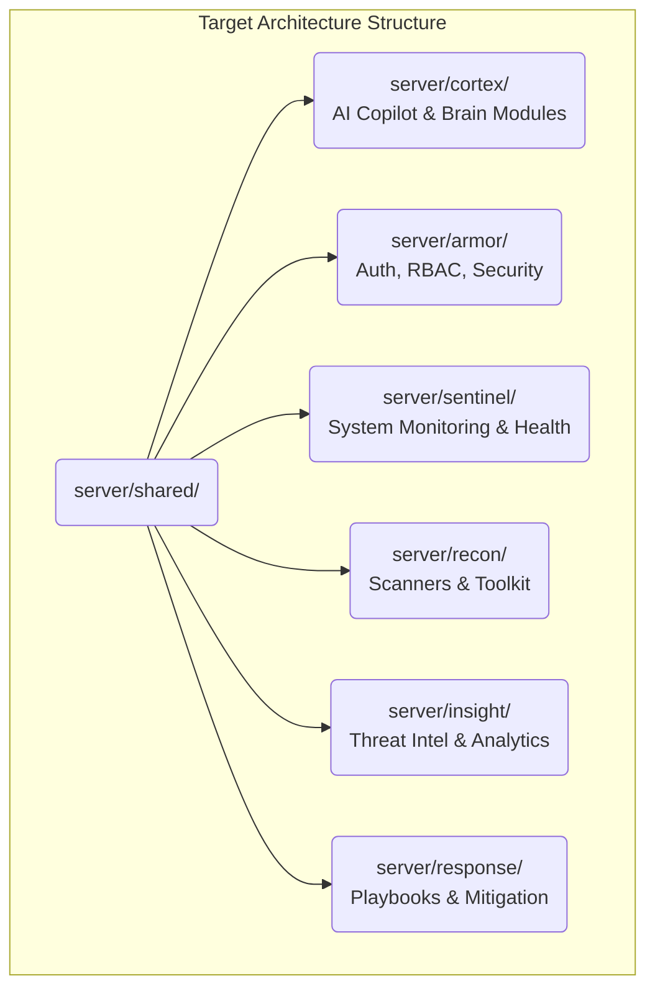

# CyberShield X - Architecture Guidelines

This document outlines the current state and the intended future target state of the CyberShield X architecture, establishing a migration strategy for long-term scalability.

## 1. Current Architecture (Version 18.0.0)

CyberShield X uses a hybrid approach, transitioning from a legacy MVC monolith to an Event-Driven Service-Oriented Architecture using Dependency Injection.

- **Legacy Core**: Standard Express MVC paradigm for business logic (`server/controllers/`, `server/services/`, `server/routes/`). This contains significant technical debt (e.g., `toolkitController.js`).
- **Modern Core (V18.0.0)**: Fully decoupled, event-driven orchestration layer located primarily in `server/services/chatbot_core/` and specialized feature folders (`server/services/jobs/`, `server/services/workflows/`, `server/services/intelligence/`, `server/services/scanners/`).

## 2. Core V18.0.0 Modules

- **Execution Orchestration**: `ExecutionOrchestrator`, `ExecutionDispatcher`, `ScanExecutionService`. Controls capability routing.
- **Workflow Engine**: `WorkflowExecutionService`, `WorkflowManager`. Orchestrates parallel and sequential DAGs (Feature 010).
- **Job Management**: `JobManager`, `JobScheduler`, `JobRepository`. Handles execution lifecycles and FIFO queueing.
- **Intelligence & Correlation**: `CorrelationEngine`, `FindingDeduplicator`, `RiskScoringService`. Generates unified immutable intelligence reports from disparate scanner outputs (Feature 009).
- **Storage Abstraction**: `IStorageProvider`, `MongoStorageProvider`. Persistent storage decoupling for Jobs and Workflows (Feature 011).
- **Notification Engine**: `NotificationSubscriptionService`, `NotificationDispatcher`, `WebSocketTransport`. Event-driven observer pattern for domain events (Feature 013).
- **Governance & Safety**: `CapabilityAuthorizationService`, `GovernanceManager`, `SafetyManager`. Intercepts all capabilities prior to execution.
- **Observability & Health Monitoring**: `SystemHealthService`, `observabilityMiddleware`. Server-side aggregation of runtime telemetry across API, Database, Auth, AI node, Threat Intel, and Deployment subsystems (Feature 020).
- **Deployment Observability, Launch Gate, SEO & Open Source Standards Domain**: `DeploymentService`, `GitHubDeploymentAdapter`, `VercelDeploymentAdapter`, `RenderDeploymentAdapter`, `DeploymentHealthCorrelator`, `DeploymentConfigValidator`, `ProductionConfigValidator`, `StagingChecker`, `ReleaseChecker`. Server-side provider adapters, automated 30-minute health anomaly correlation, zero-leak environment validation, Cloudflare Pages security headers, dynamic CORS matching for `*.pages.dev`, non-destructive staging CLI (`npm run verify:staging`), automated release check CLI (`npm run verify:release`), 10–15s global live model execution deadlines, canonical Cloudflare Pages SEO integration (`sitemap.xml`, `robots.txt`, `_headers`), GitHub open-source repository governance (`LICENSE`, `CONTRIBUTING.md`, `SECURITY.md`), and launch gate checklist (`RELEASE_CHECKLIST.md`) (Features 021, 022, 023, 024, 025, 026, 027).

## 3. Future Architecture (Target State)

The project will migrate entirely to a highly decoupled, domain-driven structure, removing the legacy MVC monolith.

## 4. Layer Diagram & Dependency Rules

1. **Shared Layer (`server/shared/`)**: Contains only constants, interfaces, and utilities. **No business logic.** Must not depend on any domain module.
2. **Domain Modules (`cortex`, `armor`, etc.)**: Standalone business domains. They can depend on `shared/` but communicate with each other via interfaces or internal Event Buses to prevent circular dependencies.
3. **API Controllers**: Must act merely as thin wrappers injecting dependencies into Domain modules (e.g., `chatbotController.js`, `ExecutionController.js`, `WorkflowController.js`). No business or queue logic allowed in controllers.

## 5. Architectural Non-Negotiables

- **Immutable DTOs**: All cross-boundary objects MUST be frozen with `Object.freeze()`.
- **Constructor Injection**: Use Dependency Injection in all domain constructors for unit testability. No static `require` calls for repositories or providers inside services.
- **Thin Controllers**: API endpoints must only serialize/deserialize DTOs.
- **No Direct Database Access**: All persistence must flow through Repositories, which rely on `IStorageProvider`.
- **Observer-Only Notifications**: The Notification Engine must only observe domain events; it must never execute scanners, authorize execution, or modify business state.
- **Governance Enforcement**: All tool and scanner executions must flow through the Governance and Authorization layers. No backdoor local executions.
- **Fail Fast**: The system must fail fast during startup if critical dependencies (like MongoDB in production) are unavailable.

## 6. Nexus Tools Passive Integration Layer

To prevent coupling between frontend UI components and lower-level CSI engine buffers, a passive data translation layer is configured within `toolsController.js`:
1. **Payload Normalization**: Raw command output streams (e.g. WHOIS plain text, DNS record dictionaries) are formatted into clean, flat JSON structures immediately before HTTP response serialization.
2. **Context Integrity**: Parameters (such as `upi` vs `upiId` and `text` vs `message`) are translated at controller bounds, allowing the underlying service signature to remain stable while maintaining compatibility with frontends.
3. **Safety Fallbacks**: External SaaS dependencies (like Enzoic Dark Web Breach checks) must fail gracefully with HTTP 503 instead of fabricating mock intelligence or throwing internal crashes.

## 7. Nexus Toolkit 2.0 Architecture

The Nexus Toolkit is built around a highly structured, single source of truth configuration system to prevent state/definition divergence across the frontend and backend.

1. **Authoritative Config (`toolConfig.js`)**: Defines all metadata (id, name, tagline, description, category, type, status, input requirements, capabilities list, and roadmap/config notices) for every tool in the catalog.
2. **Tabbed Filtering & Search**: Instant filter and query parameters updates keep the URL synchronized, enabling direct category links from the homepage (e.g. `/toolkit?category=Reconnaissance`).
3. **Decoupled Page Layout**: The `ToolPageLayout` wrapper handles common actions like Back button routing (intelligently tracking history category state) and renders warning banners for `partial` status tools.
4. **Lightweight Orchestration**: `ToolDetailPage` acts as a pure structural router that mounts sub-views (`ScannerToolView`, `AnalyzerToolView`, `UtilityToolView`, `ComingSoonView`) dynamically based on catalog type, keeping the page composition clean and fast.

## 8. Phase 15 - Database Foundation & Capability Registry

Phase 15 establishes persistent storage schemas and audit logs for the Nexus Toolkit, ensuring security, integrity, and auditability.

1. **ToolRegistry Model**: Tracks capabilities in MongoDB, mapping them directly to the static `toolConfig.js` registry. Handles target metadata, permissions settings (`GUEST`/`USER`/`ADMIN`), and container sandboxing requirements.
2. **ToolExecution Auditing**: Captures structured audit logs for scanner invocations (`ToolExecution` model). Tracks execution timing, provider details, success states, and unique hash signatures of targets/results to preserve user privacy. Plaintext credentials, passwords, JWT tokens, and raw sensitive scan output are never persisted.
3. **Verification Schema**: Prepares verification records (`Verification` model) for two-step registrations by storing the destination (email/phone), channel (email/SMS/WhatsApp), attempt metrics, hashed tokens, and cooldown timers safely.
4. **Synchronized Seeding**: The deterministic `seedTools.js` script reconciles the static catalog definitions into MongoDB, ensuring updates are safe, inserts are managed, and no tools are silently deleted.

## 9. Phase 16 - Two-Step Registration & WhatsApp OTP Architecture

Phase 16 updates the registration and authentication domain to use a two-step signup process while enforcing security parameters.

1. **User State Isolation**: Users are created with `status: 'pending'` and `emailVerified: false` initially. Logins from pending accounts are explicitly blocked until they complete OTP verification.
2. **Provider-Agnostic Abstraction**: `WhatsAppOTPService` is structured to accept pluggable message delivery adapters. Actual provider configurations are deferred to Phase 17, using a mock warning interface for now.
3. **Hashed OTP Validation**: 6-digit random verification codes are hashed via SHA256 before storing them on Mongoose `Verification` records to prevent plaintext database exposure.
4. **Resend Cooldown & Attempt Limiters**: Prevents brute-forcing and spamming by enforcing a 60-second request cooldown timer, a 5-minute expiry (TTL), and locking/deleting verification sessions after 3 incorrect attempts.
5. **Development Bypass**: In non-production environments, generated OTPs are stored in a Git-ignored scratch directory (`scratch/last_whatsapp_otp.txt`) to allow regression test suites to complete E2E flows without logging codes to stdout.

## 10. Phase 17 - Zero-Cost Public-First Access & Security Hardening

Phase 17 transitions the platform to a zero-cost access model, removing paid SMS/WhatsApp verification layers, and hardening the security boundaries of the platform.

1. **One-Step Signup Details**: User registration is simplified into a single-step details form. Accounts are immediately created with `status: 'active'`, `emailVerified: true`, and authenticated automatically.
2. **Public-First Scanner Execution**: Scans, DNS lookups, WHOIS searches, and SSL audits are accessible anonymously by guests (routing via `tryAuthenticate` and allowing null `userId`).
3. **Download PDF Authentication Gate**: Generating and downloading PDF reports requires active authentication (routing via `authenticate` and rejecting missing database users).
4. **BOLA/IDOR Protection**: The PDF download route verifies ownership by asserting that the scan's `userId` matches the requester's ID (derived from both user DTOs and Mongoose models), returning `403 Forbidden` on mismatch, `404 Not Found` if the scan does not exist, and `401 Unauthorized` if guest.
5. **SSRF Hostname Hardening**: Scanner execution parses target hostnames, strips protocols/ports, resolves target IPs asynchronously, and blocks loopback and private networks.
6. **Open Redirect Mitigation**: Client-side redirection verifies paths via `getSafeReturnUrl()`, allowing only local relative routes and rejecting protocol-relative, javascript, or external domain redirects.

## 11. Phase 18 - Complete Security Audit, Attack-Surface Review & Production Hardening

Phase 18 implements a full attack-surface audit, mitigating critical network vulnerabilities (SSRF and DNS Rebinding) and production hardening middleware/routes.

1. **Centralized SSRF Validator**: Normalizes IP formats (decimal, octal, hex, mixed, and mapped IPv6) and validates them against standard RFC private, loopback, multicast, link-local, broadcast, and reserved address ranges.
2. **DNS Rebinding Prevention**: Validates connection targets dynamically inside connection options (`ssrfLookup`) when DNS is resolved during TCP socket establishment inside `HttpClient.js` and `HttpAdapter.js`. This eliminates the window for DNS rebinding attacks.
3. **Redirect Loop SSRF Mitigation**: Enforces recursive validation checks on redirect URLs inside HTTP clients, preventing hostname manipulation from pointing to internal network segments.
4. **CORS Explicit Origin Boundaries**: Restricts Express and Socket.IO origin checks from reflecting wildcards when credentials are enabled. Allows only explicitly defined local addresses in development and configured production domains.
5. **Authorization Verification Alignment**: Harmonizes admin route check middleware and controllers to the canonical singular field `user.role === 'admin'`.
6. **Repository & Schema Compatibility**: Configures Mongoose `Organization` auto-slug validation for legacy integration tests, and adapts user repositories and authentication middleware to resolve user entities across decoupled storage layers.

