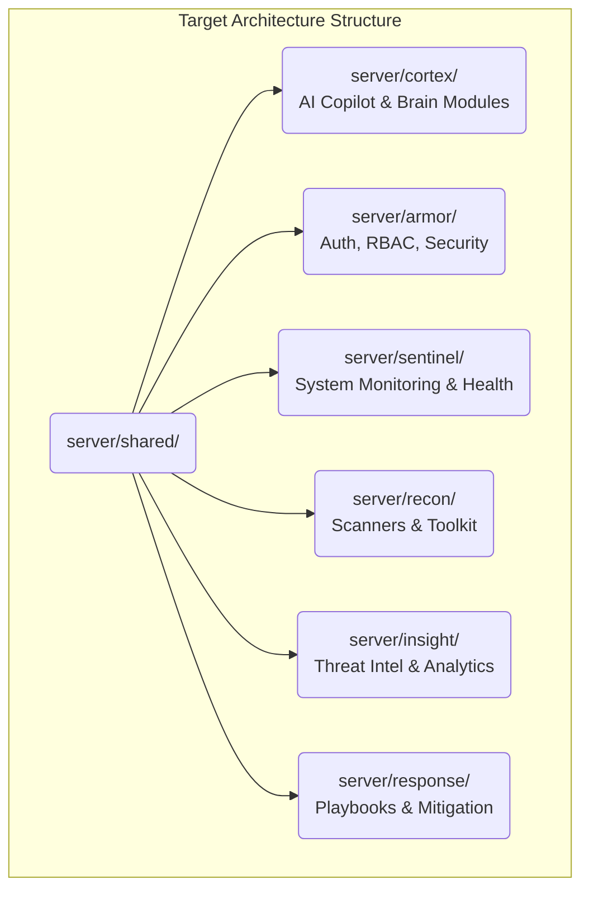

# CyberShield X - Architecture Guidelines

This document outlines the current state and the intended future target state of the CyberShield X architecture, establishing a migration strategy for long-term scalability.

## 1. Current Architecture (Version 13.0.0)

CyberShield X uses a hybrid approach, transitioning from a legacy MVC monolith to an Event-Driven Service-Oriented Architecture using Dependency Injection.

- **Legacy Core**: Standard Express MVC paradigm for business logic (`server/controllers/`, `server/services/`, `server/routes/`). This contains significant technical debt (e.g., `toolkitController.js`).
- **Modern Core (V13.0.0)**: Fully decoupled, event-driven orchestration layer located primarily in `server/services/chatbot_core/` and specialized feature folders (`server/services/jobs/`, `server/services/workflows/`, `server/services/intelligence/`, `server/services/scanners/`).

## 2. Core V13.0.0 Modules

- **Execution Orchestration**: `ExecutionOrchestrator`, `ExecutionDispatcher`, `ScanExecutionService`. Controls capability routing.
- **Workflow Engine**: `WorkflowExecutionService`, `WorkflowManager`. Orchestrates parallel and sequential DAGs (Feature 010).
- **Job Management**: `JobManager`, `JobScheduler`, `JobRepository`. Handles execution lifecycles and FIFO queueing.
- **Intelligence & Correlation**: `CorrelationEngine`, `FindingDeduplicator`, `RiskScoringService`. Generates unified immutable intelligence reports from disparate scanner outputs (Feature 009).
- **Storage Abstraction**: `IStorageProvider`, `MongoStorageProvider`. Persistent storage decoupling for Jobs and Workflows (Feature 011).
- **Notification Engine**: `NotificationSubscriptionService`, `NotificationDispatcher`, `WebSocketTransport`. Event-driven observer pattern for domain events (Feature 013).
- **Governance & Safety**: `CapabilityAuthorizationService`, `GovernanceManager`, `SafetyManager`. Intercepts all capabilities prior to execution.

## 3. Future Architecture (Target State)

The project will migrate entirely to a highly decoupled, domain-driven structure, removing the legacy MVC monolith.

## 4. Layer Diagram & Dependency Rules

1. **Shared Layer (`server/shared/`)**: Contains only constants, interfaces, and utilities. **No business logic.** Must not depend on any domain module.
2. **Domain Modules (`cortex`, `armor`, etc.)**: Standalone business domains. They can depend on `shared/` but communicate with each other via interfaces or internal Event Buses to prevent circular dependencies.
3. **API Controllers**: Must act merely as thin wrappers injecting dependencies into Domain modules (e.g., `chatbotController.js`, `ExecutionController.js`, `WorkflowController.js`). No business or queue logic allowed in controllers.

## 5. Architectural Non-Negotiables

- **Immutable DTOs**: All cross-boundary objects MUST be frozen with `Object.freeze()`.
- **Constructor Injection**: Use Dependency Injection in all domain constructors for unit testability. No static `require` calls for repositories or providers inside services.
- **Thin Controllers**: API endpoints must only serialize/deserialize DTOs.
- **No Direct Database Access**: All persistence must flow through Repositories, which rely on `IStorageProvider`.
- **Observer-Only Notifications**: The Notification Engine must only observe domain events; it must never execute scanners, authorize execution, or modify business state.
- **Governance Enforcement**: All tool and scanner executions must flow through the Governance and Authorization layers. No backdoor local executions.
- **Fail Fast**: The system must fail fast during startup if critical dependencies (like MongoDB in production) are unavailable.
