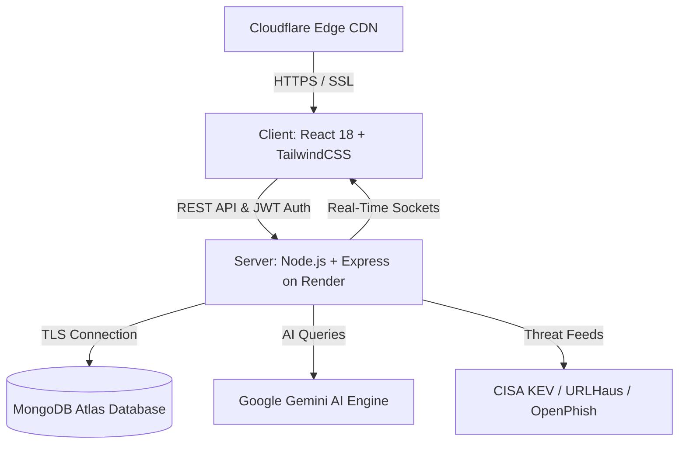

# CyberShield X 🛡️

**Next-Generation AI-Powered Cybersecurity Threat Intelligence & Interactive CyberSOC Platform**

[](https://www.cybershieldx.in)
[](https://www.cybershieldx.in/toolkit)
[](https://www.cybershieldx.in/toolkit)
[](LICENSE)

---

## 🌐 Live Production Links

| Resource | URL |
| :--- | :--- |
| **Official Website** | [https://www.cybershieldx.in](https://www.cybershieldx.in) |
| **Apex Domain** | [https://cybershieldx.in](https://cybershieldx.in) |
| **Production Backend API** | [https://cybershield-x.onrender.com](https://cybershield-x.onrender.com) |
| **API Health Telemetry** | [https://cybershield-x.onrender.com/health](https://cybershield-x.onrender.com/health) |
| **Interactive Terminal Suite** | [https://www.cybershieldx.in/toolkit](https://www.cybershieldx.in/toolkit) |
| **Cyber Command Core Team** | [https://www.cybershieldx.in/team](https://www.cybershieldx.in/team) |

---

## 🌟 What is CyberShield X?

**CyberShield X** is a full-stack, enterprise-grade cybersecurity platform built to make vulnerability assessment, network scanning, threat intelligence, and AI-assisted defense simple, fast, and accessible.

Whether you are auditing a domain, analyzing dark web breach history, checking SSL/TLS certificates, or running multi-vector penetration tests, CyberShield X gives you an interactive, real-time command center in your browser.

---

## 🚀 Key Features

### 💻 1. Interactive CyberSOC Terminal Engine (Tri-Hybrid Mode)
Execute real cybersecurity diagnostics directly inside an in-browser CRT/Matrix terminal:
* **Single Tool Mode**: Run individual tools (`nmap`, `dig`, `whois`, `curl`, `ssl-check`, `subfinder`, `shodan`, `traceroute`, `hashcat`, etc.).
* **⚡ 5-Step Chained Playbook**: One-click automated pentest pipeline (DNS Recon ➔ Port Scan ➔ SSL Audit ➔ HTTP Headers ➔ Threat Feeds).
* **🤖 AI Copilot CLI**: Natural language parser that translates simple human queries (e.g. *"find open ports on scanme.nmap.org"*) into real executable CLI commands.

### 🛡️ 2. Authoritative 110-Model Security Catalog (24 Categories)
All 110 specialized engines are active and ready to run across 24 intelligence domains:
* **Reconnaissance & OSINT**: DNS enumeration, WHOIS lookup, Subdomain discovery (Subfinder), Shodan queries, TheHarvester.
* **Web & Vulnerability Security**: Open port scanner (Nmap), HTTP security headers audit, SSL/TLS certificate inspector, WhatWeb tech detection, WPScan, Nikto, Nuclei.
* **Threat Intelligence & Identity**: Real-time IOC feeds (URLHaus, OpenPhish, CISA KEV), Dark Web breach check (HIBP k-Anonymity), JWT decoder, Base64/Hex converter, Hash identifier.
* **Social Engineering Defense**: Phishing URL analyzer, SMS fraud detector, UPI VPA payment verification.

### 🤖 3. CyboBot AI Security Copilot (Gemini 2.5 Flash)
* Integrated AI triage assistant that analyzes scan results, highlights critical vulnerabilities, and provides step-by-step remediation plans.
* Instant fallback neural knowledge base for fast answers on SSL validity, subdomains, UPI fraud prevention, and header hardening.

### 🔒 4. Enterprise Zero-Trust & Privacy Protection
* **Mandatory Login Gate**: Ensures all live terminal runs and scans are executed only by authenticated operators, preventing SSRF and server abuse.
* **Auto-Save Scan History**: Every completed scan automatically saves to your dashboard and `/history` page.
* **1-Click Executive Security Dossier**: Export a formatted, branded `.txt` security audit report with one click.

---

## 🏗️ Technology Stack



| Layer | Technology | Purpose |
| :--- | :--- | :--- |
| **Frontend** | React 18, TailwindCSS, Framer Motion, Lucide Icons | Responsive CyberSOC UI, Interactive Terminal, HUD Dashboards |
| **Edge & CDN** | Cloudflare Pages & Authoritative DNS | DDoS Mitigation, Universal SSL, Edge Caching, HSTS |
| **Backend API** | Node.js, Express, Winston Logger, Helmet, CORS | RESTful API, Task Dispatcher, Rate Limiting, SSRF Guard |
| **Database** | MongoDB Atlas | User Accounts, Audit Trails, Saved Scan Histories |
| **AI Intelligence**| Google Gemini API + Local Heuristics | Real-time threat classification, AI Copilot, Remediation plans |

---

## 👥 Leadership & Core Team

Visit our interactive Cyber Command Center at [https://www.cybershieldx.in/team](https://www.cybershieldx.in/team).

* **Anil Kumar** — *Founder & Command Chief* (Architecture, Core Platform & Strategic Vision)
* **Suryansh** — *Core Security Architect* (Vulnerability Assessment & Network Defense)
* **Aryan Patel** — *Lead SOC Engineer* (SIEM Monitoring, Threat Intelligence & Incident Response)
* **Pranav** — *AI & Threat Intelligence* (Machine Learning Models & Automation)
* **Ankita** — *DevOps & Cloud Security* (CI/CD Pipelines, Infrastructure Hardening & Cloud Reliability)
* **Sushant** — *Data Analyst* (Threat Analytics, Telemetry Correlation & Visualizations)

---

## 🛠️ Getting Started (Local Development)

### 1. Clone the Repository
```bash
git clone https://github.com/Kumar11rudra/CYBERSHIELD-X.git
cd CYBERSHIELD-X
```

### 2. Install Dependencies
```bash
# Install root, client, and server dependencies
npm run install:all
```

### 3. Setup Environment Variables
Create `.env` file in the `server` directory:
```bash
cp server/.env.example server/.env
```
Fill in your `MONGODB_URI`, `JWT_SECRET`, and `GEMINI_API_KEY`.

### 4. Start Development Servers
```bash
npm run dev
```
* **Frontend App**: `http://localhost:3000`
* **Backend API**: `http://localhost:3001`

---

## 🧪 Testing & Verification

```bash
# 1. Run all unit and integration tests
cd server && npm test

# 2. Run release readiness verification
npm run verify:release

# 3. Build optimized production frontend
cd ../client && npm run build
```

---

## 📜 License & Governance

* **Contributing**: Please review [CONTRIBUTING.md](CONTRIBUTING.md) before submitting pull requests.
* **Security Policy**: For responsible vulnerability disclosure, see [SECURITY.md](SECURITY.md).
* **License**: Released under the [MIT License](LICENSE).

---

<div align="center">

**CyberShield X** • *Defending Digital Boundaries with Precision & Intelligence*  
Built with ❤️ by **[Anil Kumar](https://github.com/Kumar11rudra)** & The CyberShield X Team.

</div>
