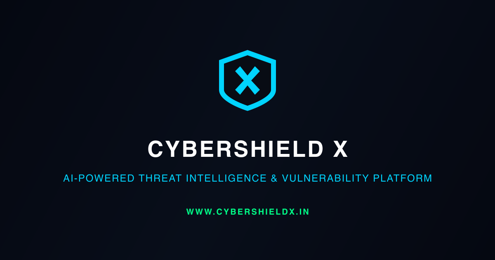
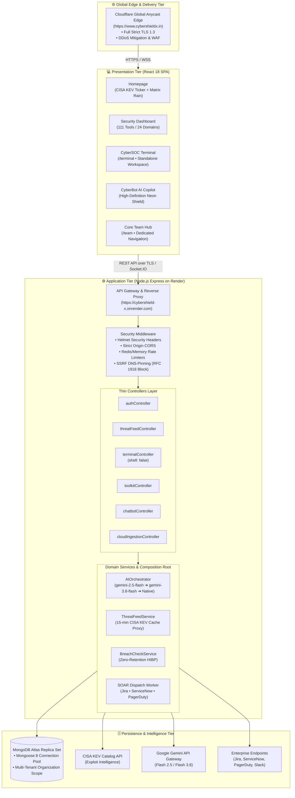
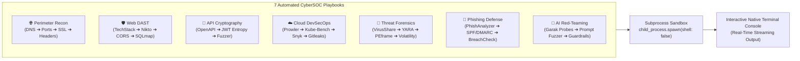
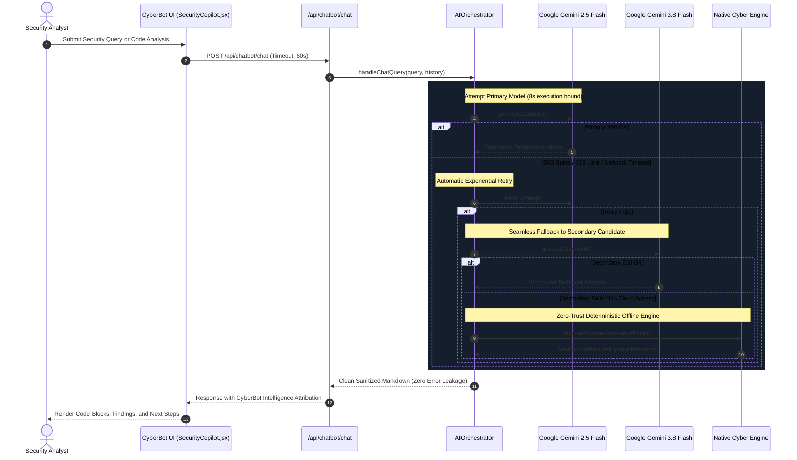

# <p align="center"></p>

<h1 align="center" style="font-family: 'Orbitron', sans-serif; font-size: 2.8rem; font-weight: 900; letter-spacing: 2px;">
  CYBERSHIELD X 🛡️
</h1>

<p align="center">
  <b>Next-Generation Autonomous Threat Intelligence, Interactive CyberSOC Workstation & Multi-Cloud Security Ecosystem</b>
</p>

<p align="center">
  <a href="https://www.cybershieldx.in"></a>
  <a href="https://www.cybershieldx.in/terminal"></a>
  <a href="https://www.cybershieldx.in/dashboard"></a>
  <a href="https://cybershield-x.onrender.com/health"></a>
  <a href="https://www.cybershieldx.in"></a>
  <a href="LICENSE"></a>
</p>

<p align="center">
  <a href="https://www.cybershieldx.in"><b>🌐 Live Platform</b></a> •
  <a href="https://www.cybershieldx.in/terminal"><b>💻 CyberSOC Terminal</b></a> •
  <a href="https://www.cybershieldx.in/team"><b>👥 Core Team</b></a> •
  <a href="https://cybershield-x.onrender.com/health"><b>⚡ Health Telemetry</b></a> •
  <a href="#-system-architecture"><b>📐 Architecture</b></a> •
  <a href="#-authoritative-111-tool-catalog"><b>🧰 Tools Registry</b></a> •
  <a href="#-quickstart--local-development"><b>🚀 Quick Start</b></a>
</p>

---

## ⚡ Executive Summary

**CyberShield X** is a production-grade, full-stack cybersecurity operations platform engineered for Security Operations Centers (SOC), Red/Blue Teams, DevSecOps professionals, and security researchers. 

Built on a zero-trust, defence-in-depth philosophy, CyberShield X fuses **real-time CISA exploit monitoring**, an authoritative **111-tool operational security registry**, a sandboxed **host-native diagnostic terminal**, a **resilient multi-model AI Copilot (CyberBot)**, and a **multi-cloud event normalization fabric** into a unified, high-performance cyber command center.

```
                   ╔════════════════════════════════════════════════════╗
                   ║              CYBERSHIELD X AT A GLANCE             ║
                   ╠════════════════════════════════════════════════════╣
                   ║  • 111 Canonical Security Tools across 24 Domains  ║
                   ║  • Real-Time CISA KEV Live Exploit Stream          ║
                   ║  • Subprocess-Sandboxed CyberSOC Terminal          ║
                   ║  • 7 Automated Multi-Vector SOC Playbooks          ║
                   ║  • Resilient Dual-Model AI Security Copilot        ║
                   ║  • Multi-Cloud Ingestion: AWS, GCP, Azure          ║
                   ║  • Enterprise ITSM: Jira, ServiceNow, PagerDuty    ║
                   ║  • Quantum Vault with AES-256-GCM Encryption       ║
                   ╚════════════════════════════════════════════════════╝
```

---

## 🌟 Core Differentiators & Key Features

### 1. 🧰 111 Canonical Security Tools Across 24 Domains
An exhaustive, standardized security intelligence and testing catalog spanning every modern cyber discipline:
* **41 ONLINE Tools**: Direct browser-based scanners and diagnostic interfaces (SSL Labs, MXToolbox, Shodan, Port Scanners, DNS Enumeration, Breach Detection).
* **70 COMING_SOON Tools**: Curated native and enterprise tools with direct references to official repositories and secure alternative advisory modals.
* **Zero Misleading CTAs**: Absolute invariant — external tools link strictly to verified services or official GitHub repositories, never obfuscated.

### 2. 💻 Sandboxed Interactive CyberSOC Terminal (`/terminal`)
A standalone, high-octane CLI workstation running directly inside the browser with zero sidebar clutter:
* **Host-Native Binary Execution**: Safely invokes allowlisted diagnostic executables (`nmap`, `dig`, `whois`, `ping`, `traceroute`, `curl`, `openssl`, `host`, `nslookup`).
* **Subprocess Security Model**: Process invocation via `child_process.spawn()` with `shell: false`. Shell metacharacters (`;`, `|`, `&`, `` ` ``, `$`, `>`, `<`, `\`) are strictly neutralized.
* **Execution Safeguards**: 10-second automated process watchdog kill switch and memory limits.

### 3. 🤖 Resilient CyberBot AI Security Copilot
An omniscient, multi-model technical companion designed for real-time security analysis and code remediation:
* **Multi-Model Fallback Hierarchy**: Primary requests dispatch to `gemini-2.5-flash`; automatic seamless fallback cascades to `gemini-3.8-flash` during demand spikes.
* **Transient Error Immunity**: Automatic retries with exponential backoff on HTTP 503 (high demand) and 429 (rate limits).
* **Zero-Trust Built-In Knowledge Engine**: If all external cloud AI providers are unreachable, CyberShield X's native deterministic intelligence engine takes over with zero downtime.
* **Zero Technical Error Leakage**: Internal API URLs and stack traces are permanently scrubbed from client chat bubbles.
* **Restored CyberShield Neon Avatar**: Rendered across floating workstation triggers, chat headers, and conversation logs.

### 4. 📡 Real-Time CISA KEV Threat Ticker
* Directly connected to the official **U.S. Cybersecurity and Infrastructure Security Agency (CISA)** Known Exploited Vulnerabilities Catalog.
* Features a backend cache proxy with a **15-minute Time-To-Live (TTL)** to eliminate third-party rate limits.
* Client privacy guaranteed: browsers query the backend proxy (`GET /api/threat-feed`), never making direct outbound requests to government endpoints.

### 5. ☁️ Multi-Cloud Telemetry Ingestion (Phase 80)
* Normalized event pipeline accepting **AWS CloudTrail**, **Google Cloud Platform (GCP) Cloud Audit**, and **Microsoft Azure Activity Logs**.
* Canonical security schema normalization with real-time risk scoring, MITRE ATT&CK mapping, and event correlation.

### 6. 🚀 Enterprise ITSM & SOAR Dispatch Fabric (Phase 81)
* Automated outbound incident routing to **Jira**, **ServiceNow**, **PagerDuty**, **Slack**, and **Microsoft Teams**.
* HMAC-SHA256 signature verification on webhooks with automatic retries and dead-letter queue (DLQ) isolation.

---

## 📐 System Architecture

CyberShield X is architected as an enterprise decoupled tier topology enforcing strict boundary isolation, the Repository Pattern, and Constructor Dependency Injection:


```mermaid
flowchart TD
    subgraph EdgeTier["🌐 Global Edge & Delivery Tier"]
        CF["Cloudflare Global Anycast Edge\n(https://www.cybershieldx.in)\n• Full Strict TLS 1.3\n• DDoS Mitigation & WAF"]
    end

    subgraph ClientTier["💻 Presentation Tier (React 18 SPA)"]
        UI_Home["Homepage\n(CISA KEV Ticker + Matrix Rain)"]
        UI_Dash["Security Dashboard\n(111 Tools / 24 Domains)"]
        UI_Term["CyberSOC Terminal\n(/terminal • Standalone Workspace)"]
        UI_Bot["CyberBot AI Copilot\n(High-Definition Neon Shield)"]
        UI_Team["Core Team Hub\n(/team • Dedicated Navigation)"]
    end

    subgraph APITier["⚙️ Application Tier (Node.js Express on Render)"]
        GW["API Gateway & Reverse Proxy\n(https://cybershield-x.onrender.com)"]
        MW["Security Middleware\n• Helmet Security Headers\n• Strict Origin CORS\n• Redis/Memory Rate Limiters\n• SSRF DNS-Pinning (RFC 1918 Block)"]
        
        subgraph Controllers["Thin Controllers Layer"]
            C_Auth["authController"]
            C_Threat["threatFeedController"]
            C_Term["terminalController\n(shell: false)"]
            C_Tools["toolkitController"]
            C_AI["chatbotController"]
            C_Cloud["cloudIngestionController"]
        end

        subgraph CoreServices["Domain Services & Composition Root"]
            S_AI["AIOrchestrator\n(gemini-2.5-flash ➔ gemini-3.8-flash ➔ Native)"]
            S_Threat["ThreatFeedService\n(15-min CISA KEV Cache Proxy)"]
            S_Breach["BreachCheckService\n(Zero-Retention HIBP)"]
            S_Queue["SOAR Dispatch Worker\n(Jira • ServiceNow • PagerDuty)"]
        end
    end

    subgraph DataTier["🗄️ Persistence & Intelligence Tier"]
        DB[(MongoDB Atlas Replica Set\n• Mongoose 8 Connection Pool\n• Multi-Tenant Organization Scope)]
        CISA["CISA KEV Catalog API\n(Exploit Intelligence)"]
        GEMINI["Google Gemini API Gateway\n(Flash 2.5 / Flash 3.8)"]
        ITSM["Enterprise Endpoints\n(Jira, ServiceNow, PagerDuty, Slack)"]
    end

    CF -->|HTTPS / WSS| ClientTier
    ClientTier -->|REST API over TLS / Socket.IO| GW
    GW --> MW
    MW --> Controllers
    Controllers --> CoreServices
    CoreServices --> DB
    CoreServices --> CISA
    CoreServices --> GEMINI
    CoreServices --> ITSM
```

---

## 🛡️ CyberSOC Terminal & 7 Multi-Vector Playbooks

The **CyberSOC Terminal** (`/terminal`) provides automated playbooks that execute multi-phase defensive and offensive audit workflows with single-click precision:


```mermaid
graph LR
    subgraph Playbooks["7 Automated CyberSOC Playbooks"]
        PB1["🌐 Perimeter Recon\n(DNS ➔ Ports ➔ SSL ➔ Headers)"]
        PB2["🛡️ Web DAST\n(TechStack ➔ Nikto ➔ CORS ➔ SQLmap)"]
        PB3["🔑 API Cryptography\n(OpenAPI ➔ JWT Entropy ➔ Fuzzer)"]
        PB4["☁️ Cloud DevSecOps\n(Prowler ➔ Kube-Bench ➔ Snyk ➔ Gitleaks)"]
        PB5["🔬 Threat Forensics\n(VirusShare ➔ YARA ➔ PEframe ➔ Volatility)"]
        PB6["🎣 Phishing Defense\n(PhishAnalyzer ➔ SPF/DMARC ➔ BreachCheck)"]
        PB7["🤖 AI Red-Teaming\n(Garak Probes ➔ Prompt Fuzzer ➔ Guardrails)"]
    end

    Playbooks --> Sandbox["Subprocess Sandbox\nchild_process.spawn(shell: false)"]
    Sandbox --> Console["Interactive Native Terminal Console\n(Real-Time Streaming Output)"]
```

---

## 🧰 Authoritative 111-Tool Catalog

Every tool is strictly registered with canonical metadata, domain mapping, execution boundaries, and risk scores:

| # | Operational Domain | Tools | Active Scanners & Reference Platforms |
| :---: | :--- | :---: | :--- |
| **01** | **Reconnaissance & OSINT** | 10 | DNS Enumerator, WHOIS Engine, Subdomain Discovery, Shodan Search, theHarvester, Sherlock, Amass |
| **02** | **Web & DAST Security** | 8 | Port Scanner, Service Fingerprinting, HTTP Header Auditor, SSL/TLS Handshake, Nikto, OWASP ZAP |
| **03** | **Vulnerability Scanning** | 8 | CVE Inspector, SQLmap Database Auditor, Trivy Container Auditor, WPScan, Nuclei, OpenVAS |
| **04** | **Threat Intelligence** | 8 | URL Threat Intel, Dark Web Breach Checker, AlienVault OTX, VirusShare Hash Search, Maltiverse |
| **05** | **Cloud Security & Posture** | 4 | Prowler AWS CIS Benchmark, Scout Suite Multi-Cloud, S3 Bucket Finder, Cloud IAM Linter |
| **06** | **API Security & Cryptography** | 4 | Postman Auditor, JWT Strength & Entropy Auditor, API Endpoint Fuzzer, Swagger Spec Linter |
| **07** | **Authentication & Identity** | 4 | Hydra Protocol Auditor, LDAP Policy Auditor, SAML Security Decoder, OAuth 2.0 Flow Validator |
| **08** | **Mobile AppSec (iOS & Android)** | 4 | MobSF Android Manifest, iOS IPA Binary Validator, APK Secrets Extractor, Androguard Decompiler |
| **09** | **Container & Kubernetes** | 4 | Kube-Bench CIS, Kubesec Pod Linter, Docker CIS Benchmark, Falco Runtime Syscall Inspector |
| **10** | **DevSecOps / Supply Chain** | 4 | Semgrep SAST Engine, Gitleaks Secrets Scanner, Dependency-Track SBOM, Snyk Vulnerability Checker |
| **11** | **Malware Analysis & Reversing** | 4 | YARA Pattern Matcher, PE Binary Header Analyzer, Cuckoo Sandbox Interface, PDF Document Inspector |
| **12** | **Digital Forensics & IR** | 4 | Autopsy Digital Forensics, Volatility Memory Analysis, Sleuth Kit Filesystem, Plaso Timeline Engine |
| **13** | **Reverse Engineering** | 4 | Ghidra Headless Decompiler, Radare2 Shellcode Inspector, Binwalk Firmware Extractor, Capstone Engine |
| **14** | **Wireless Security** | 4 | Aircrack-ng Suite, Kismet Wireless Survey, Wifite Audit Interface, Bluetooth Low Energy (BLE) Scanner |
| **15** | **Email Security & Phishing** | 4 | Email Spoofing & DMARC/SPF, MX Blacklist Auditor, Email Hop Analyzer, Phishing Link Detector |
| **16** | **Social Engineering Defense** | 4 | GoPhish Campaign Simulator, Domain Typosquatting Analyzer, Evilginx MFA Bypass Guard, Profiler |
| **17** | **AI & LLM Security** | 4 | Prompt Injection Guard, Garak LLM Vulnerability Scanner, AI Adversarial Red-Team, Boundary Fuzzer |
| **18** | **Privacy & Data Protection** | 4 | GDPR Cookie Auditor, Image EXIF Metadata Stripper, Sensitive PII Scanner, Compliance Planner |
| **19** | **Security Operations & SOAR** | 4 | TheHive Incident Manager, MISP Threat Publisher, SOC Playbook Orchestrator, Wazuh SIEM Connector |
| **20** | **Network Traffic Analysis** | 4 | Zeek Transaction Parser, Suricata NIDS Rule Tester, Snort Rule Generator, Tcpdump Capture Filter |
| **21** | **Threat Hunting & Detection** | 4 | Sigma Rule Compiler, Atomic Red Team Runner, MITRE ATT&CK Matrix Navigator, OSQuery Engine |
| **22** | **Active Directory Security** | 4 | BloodHound Graph Ingest, Kerberoasting Detector, Mimikatz Output Parser, AD ACL Auditor |
| **23** | **IoT & ICS / SCADA Security** | 4 | Modbus Protocol Auditor, DNP3 Packet Inspector, MQTT Broker Security Checker, Shodan ICS Search |
| **24** | **Compliance & Governance** | 5 | SOC 2 Posture Evaluator, HIPAA ePHI Auditor, PCI-DSS Assessment, NIST CSF 2.0, ISO 27001 Auditor |

---

## 🤖 CyberBot AI Copilot Architecture


```mermaid
sequenceDiagram
    autonumber
    actor Analyst as Security Analyst
    participant UI as CyberBot UI (SecurityCopilot.jsx)
    participant API as /api/chatbot/chat
    participant Orch as AIOrchestrator
    participant G25 as Google Gemini 2.5 Flash
    participant G38 as Google Gemini 3.8 Flash
    participant Native as Native Cyber Engine

    Analyst->>UI: Submit Security Query or Code Analysis
    UI->>API: POST /api/chatbot/chat (Timeout: 60s)
    API->>Orch: handleChatQuery(query, history)
    
    rect rgb(20, 30, 45)
        Note over Orch,G25: Attempt Primary Model (8s execution bound)
        Orch->>G25: generateContent()
        alt Primary 200 OK
            G25-->>Orch: Structured Technical Analysis
        else 503 Spike / 429 Limit / Network Timeout
            Note over Orch: Automatic Exponential Retry
            Orch->>G25: Retry Attempt
            alt Retry Fails
                Note over Orch,G38: Seamless Fallback to Secondary Candidate
                Orch->>G38: generateContent()
                alt Secondary 200 OK
                    G38-->>Orch: Structured Technical Analysis
                else Secondary Fails / No Cloud Access
                    Note over Orch,Native: Zero-Trust Deterministic Offline Engine
                    Orch->>Native: evaluateNativeKnowledgeBase()
                    Native-->>Orch: Verified Native Intelligence Response
                end
            end
        end
    end

    Orch-->>API: Clean Sanitized Markdown (Zero Error Leakage)
    API-->>UI: Response with CyberBot Intelligence Attribution
    UI-->>Analyst: Render Code Blocks, Findings, and Next Steps
```

---

## 🚀 Quickstart & Local Development

### 1. Prerequisites
* **Node.js**: `v18.x` or `v20.x` LTS
* **npm**: `v9.x` or `v10.x`
* **MongoDB**: Local Community Server (`mongodb://127.0.0.1:27017/cybershield`) or a free MongoDB Atlas connection URI.

### 2. Single-Command Setup
```bash
# Clone the repository
git clone https://github.com/Kumar11rudra/CYBERSHIELD-X.git
cd CYBERSHIELD-X

# Install all dependencies across root, server, and client with legacy peer deps
npm run install:all
```

### 3. Environment Configuration
Create the backend environment file:
```bash
cp server/.env.example server/.env
```
Configure your core environment variables in `server/.env`:
```ini
PORT=3001
NODE_ENV=development
MONGODB_URI=mongodb://127.0.0.1:27017/cybershield
JWT_SECRET=your_ultra_secure_at_least_64_character_access_jwt_secret_key
JWT_REFRESH_SECRET=your_ultra_secure_at_least_64_character_refresh_jwt_secret_key
GEMINI_API_KEY=your_optional_gemini_api_key
```

### 4. Admin Bootstrap (Zero Default Credentials)
```bash
cd server
ADMIN_EMAIL=admin@cybershieldx.local ADMIN_PASSWORD=YourStrongPassword123! npm run seed:admin
cd ..
```

### 5. Launch Full-Stack Local Workstation
```bash
# Concurrently boots Node.js Express backend (Port 3001) & React Frontend (Port 3000)
npm run dev
```
Open **[http://localhost:3000](http://localhost:3000)** in your browser.

---

## 🧪 Testing & Quality Assurance

CyberShield X enforces strict quality gates before any commit or release. All test batteries are 100% green:

```bash
# ─── 1. Run Complete Client Test Battery (13 Suites, 136 Tests) ─────────────
npm --prefix client test -- --watchAll=false

# ─── 2. Compile Optimized Production Frontend (Zero Warnings as Errors) ─────
npm --prefix client run build

# ─── 3. Run Core Backend Test Suites (Threat Feed, AI Failover, Registry) ───
npm --prefix server test -- tests/threatFeed.test.js tests/ai_provider_routing.test.js tests/canonical_111_tool_registry.test.js

# ─── 4. Run Comprehensive Phase 25 Production Staging Audit ─────────────────
node server/scripts/stagingCheck.js
```

### Quality Metrics:
* **Client Test Pass Rate**: `136 / 136 tests (100% PASS)`
* **Server Core Pass Rate**: `20 / 20 tests (100% PASS)`
* **Production Build Output**: `Exit Code 0` (Clean bundle with zero circular imports)
* **Relative Import Health**: `0 broken relative imports` across all 57 pages & 16 Express routers.

---

## 🔒 Defense-in-Depth Security Blueprint

| Layer | Defense Mechanism | Implementation Details |
| :--- | :--- | :--- |
| **Edge & Transport** | Full Strict TLS 1.3 | Cloudflare SSL/TLS with HSTS, preconnect headers, and DNSSEC enforcement. |
| **CORS Isolation** | Dynamic Origin Matching | Strict regex allowing only canonical domain (`cybershieldx.in`) and Cloudflare Pages (`*.pages.dev`). |
| **Subprocess Execution** | Native Spawn Isolation | `child_process.spawn(cmd, args, { shell: false })`. Shell metacharacters are rejected outright. |
| **SSRF Prevention** | DNS-Pinning Outbound Agents | Outbound connectors validate IP resolution, rejecting RFC 1918 private spaces and cloud metadata IP (`169.254.169.254`). |
| **Authentication** | Dual-Token JWT Architecture | 15-minute Access Token; 7-day Refresh Token with cryptographic server-side validation and immediate revocation. |
| **Data Protection** | AES-256-GCM Quantum Vault | Sensitive user secrets and API keys are encrypted at rest with authenticated AES-256-GCM. |
| **Audit Immutability** | Organization-Scoped Telemetry | Non-repudiable audit logs record all authentication, scan executions, and SOAR dispatches. |

---

## 🌐 Live Production Topology

```
┌────────────────────────────────────────────────────────────────────────────────────────┐
│                                LIVE PRODUCTION NETWORK                                 │
├───────────────────────────────┬────────────────────────────────────────────────────────┤
│ Public Apex Domain            │ https://cybershieldx.in                                │
│ Primary Canonical Domain      │ https://www.cybershieldx.in                            │
│ Edge CDN (Cloudflare Pages)   │ https://cybershield-x.pages.dev                        │
│ Production API Gateway        │ https://cybershield-x.onrender.com                     │
│ Health Telemetry Probe        │ https://cybershield-x.onrender.com/health              │
│ Detailed Diagnostics Probe    │ https://cybershield-x.onrender.com/api/health/details │
│ Live CISA Threat Feed API     │ https://cybershield-x.onrender.com/api/threat-feed     │
│ Standalone CyberSOC Terminal  │ https://www.cybershieldx.in/terminal                   │
│ Core Team Portal              │ https://www.cybershieldx.in/team                       │
└───────────────────────────────┴────────────────────────────────────────────────────────┘
```

---

## 👥 Core Team & Leadership

CyberShield X is architected and built by a dedicated team of cybersecurity engineers and systems architects:

<p align="center">
  <a href="https://www.cybershieldx.in/team">
    
  </a>
</p>

* **Rudra Kumar** — *Founder & Lead Architect*
* **Core Engineering Team** — *Security Operations, Full-Stack Architecture & AI Intelligence*
* **Official Contact**: [official.cybershieldx@gmail.com](mailto:official.cybershieldx@gmail.com)

---

## 📜 License & Disclosures

Distributed under the **MIT License**. See [`LICENSE`](LICENSE) for complete terms.

> **Responsible Security Research Notice**:
> CyberShield X is developed strictly for educational, defensive, and authorized penetration testing purposes. Unauthorized scanning, probing, or exploiting of network assets without prior written consent is strictly illegal and unethical. The maintainers and contributors assume zero liability for misuse.
