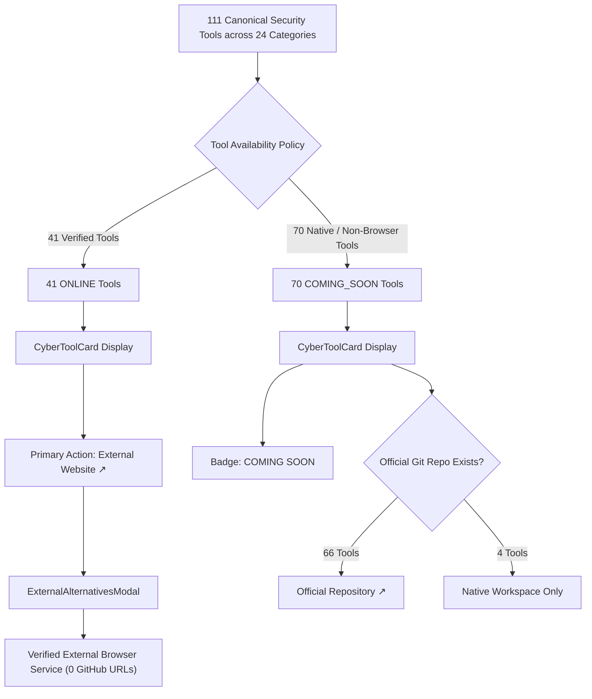

# CyberShield X 🛡️

**Next-Generation AI-Powered Cybersecurity Threat Intelligence & Interactive CyberSOC Platform**

[](https://www.cybershieldx.in)
[](https://www.cybershieldx.in/terminal)
[](https://www.cybershieldx.in/dashboard)
[](LICENSE)

---

## 🌐 Live Production Links

| Resource | URL | Status |
| :--- | :--- | :--- |
| **Official Website** | [https://www.cybershieldx.in](https://www.cybershieldx.in) | `HTTP/2 200 OK` |
| **Apex Domain** | [https://cybershieldx.in](https://cybershieldx.in) | `HTTP/2 200 OK` |
| **Cloudflare Pages CDN** | [https://cybershield-x.pages.dev](https://cybershield-x.pages.dev) | `HTTP/2 200 OK` |
| **Production Backend API** | [https://cybershield-x.onrender.com](https://cybershield-x.onrender.com) | `HTTP 200 OK` |
| **API Health Telemetry** | [https://cybershield-x.onrender.com/health](https://cybershield-x.onrender.com/health) | `{"status":"ok"}` |
| **Interactive Terminal** | [https://www.cybershieldx.in/terminal](https://www.cybershieldx.in/terminal) | Online |

---

## 🌟 What is CyberShield X?

**CyberShield X** is a full-stack, enterprise-grade cybersecurity operations platform built to make vulnerability assessment, network scanning, threat intelligence, and AI-assisted defense fast, unified, and accessible.

Whether you are auditing a domain, analyzing dark web breach history, inspecting SSL/TLS certificates, ingesting multi-cloud telemetry, or running multi-vector penetration tests, CyberShield X gives you an interactive, real-time command center in your browser.

---

## 🚀 Key Capabilities

### 💻 1. Interactive CyberSOC Terminal Workstation
Execute real cybersecurity diagnostics directly inside an in-browser terminal console (`/terminal`):
* **Host Native Execution**: Run sanitized host tools (`nmap`, `dig`, `whois`, `curl`, `openssl`, `ping`, `traceroute`).
* **Interactive Parameter Builder**: Guided command formulation with real-time argument syntax validation.
* **Process Sandboxing**: Strict binary allowlisting, regex sanitization, and automated 10-second kill switches.

### 🛡️ 2. Authoritative 111-Tool Catalog (24 Categories)
Exhaustive security operations coverage across 24 specialized domains:
* **Reconnaissance & OSINT**: DNS enumeration, WHOIS lookup, Subdomain discovery, Shodan queries, TheHarvester.
* **Web & Vulnerability Security**: Open port scanner, HTTP security headers audit, SSL/TLS certificate inspector, technology detection.
* **Threat Intelligence & Identity**: Real-time IOC feeds (URLHaus, OpenPhish, CISA KEV), Have I Been Pwned dark web breach check, JWT decoder, hash identifier.
* **111 External Alternatives Flow**: Every canonical tool provides a single-action link to an approved external utility with zero credential leakage.

### 🤖 3. CyboBot AI Security Copilot (Gemini 2.5 Flash)
* Integrated AI assistant powered by Google Gemini 2.5 Flash that analyzes scan outputs, correlates vulnerabilities, and formulates step-by-step remediation plans.
* Deterministic offline fallback reasoning engine ensures high-availability operations even during network degradation.

### ☁️ 4. Enterprise Multi-Cloud Telemetry & SOAR Automation
* **Cloud Telemetry Ingestion (Phase 80)**: Native normalization for AWS CloudTrail, GCP Cloud Audit, and Azure Activity Logs.
* **External ITSM Integrations (Phase 81)**: Bidirectional ticketing with Jira, ServiceNow, PagerDuty, Slack, and Microsoft Teams.
* **Enterprise Zero-Trust**: Strict tenant organization isolation (`req.organizationId`), session revocation on logout, and anti-tamper fingerprinting.

---

## 🏗️ System Architecture & Engineering Diagrams

### A. End-to-End System Architecture
```mermaid
graph TD
    User["Cyber Operator / Analyst"] -->|HTTPS / WSS| CDN["Cloudflare Pages Edge CDN"]
    CDN -->|Static SPA Delivery| Client["React 18 SPA (/dashboard, /terminal, /scans)"]
    Client -->|REST API over TLS (JWT Auth)| Gateway["Express API Gateway (Node.js 18+ on Render)"]
    Client <-->|Socket.IO (Authenticated Tenant Rooms)| Socket["Real-Time Push Engine"]
    Gateway --> Socket
    Gateway -->|Tenant Scoped Mongoose ODM| DB[("MongoDB Atlas Replica Set")]
    Gateway -->|Sanitized Process Execution| TermEng["Native Terminal Engine (shell: false, 10s Kill)"]
    Gateway -->|Multi-Cloud Ingestion| CloudIngest["Cloud Telemetry Fabric (AWS / Azure / GCP)"]
    Gateway -->|SOAR & Webhooks| ITSM["External ITSM Connectors (Jira / ServiceNow / PagerDuty)"]
    Gateway -->|Advisory Security Copilot| AI["Google Gemini 2.5 Flash / Local Fallback"]
```

### B. Native Terminal Security Flow
```mermaid
sequenceDiagram
    autonumber
    actor Operator as Operator (Browser)
    participant TermUI as NativeTerminalConsole (/terminal)
    participant API as Terminal Route (/api/terminal/execute)
    participant Sec as HostEnvironmentService (Validation)
    participant OS as Child Process (shell: false)

    Operator->>TermUI: Enter sanitized command (e.g. "dig example.com")
    TermUI->>TermUI: Client validation & argument formatting
    TermUI->>API: POST /api/terminal/execute (JWT, command, target)
    API->>API: Rate Limiting & Auth Token Verification
    API->>Sec: Validate binary allowlist (nmap, dig, whois, ping, etc.)
    Sec->>Sec: Sanitize target (Block SSRF: 127.0.0.1, 169.254.169.254, RFC1918)
    Sec->>Sec: Check forbidden shell metacharacters (; | & ` $ > <)
    alt Validation Failed
        Sec-->>API: 400 Bad Request / 403 Forbidden
        API-->>TermUI: Security rejection error message
    else Validation Succeeded
        Sec->>OS: spawn(binaryPath, args, { shell: false, timeout: 10000 })
        OS-->>Sec: stdout / stderr streaming chunks
        Sec-->>API: Format ANSI & execution telemetry
        API-->>TermUI: 200 OK { output, exitCode, durationMs }
        TermUI-->>Operator: Render colored terminal output
    end
```

### C. 111-Tool Ecosystem & Availability Model

```mermaid
graph TD
    Catalog["111 Canonical Security Tools across 24 Categories"] --> Split{"Tool Availability Policy"}

    Split -->|41 Verified Tools| Online["41 ONLINE Tools"]
    Split -->|70 Native / Non-Browser Tools| ComingSoon["70 COMING_SOON Tools"]

    Online --> CardA["CyberToolCard Display"]
    CardA --> ActionA["Primary Action: External Website ↗"]
    ActionA --> ModalA["ExternalAlternativesModal"]
    ModalA --> ExtNet["Verified External Browser Service (0 GitHub URLs)"]

    ComingSoon --> CardB["CyberToolCard Display"]
    CardB --> ActionB["Badge: COMING SOON"]
    CardB --> Repo{"Official Git Repo Exists?"}
    Repo -->|66 Tools| ActionRepo["Official Repository ↗"]
    Repo -->|4 Tools| ActionNone["Native Workspace Only"]
```

### D. Production Deployment Architecture
```mermaid
graph LR
    subgraph Edge ["Global Edge Tier (Cloudflare)"]
        Apex["cybershieldx.in / www.cybershieldx.in"]
        CFPages["Cloudflare Pages Deployment"]
        Apex --> CFPages
    end

    subgraph Compute ["Compute Tier (Render Web Service)"]
        API["cybershield-x.onrender.com (Node.js Express)"]
        WSS["WebSocket Telemetry Gateway"]
    end

    subgraph Data ["Data & AI Tier (Cloud Providers)"]
        Atlas[("MongoDB Atlas Multi-Region Cluster")]
        Gemini["Google Gemini 2.5 Flash API"]
        ThreatFeeds["CISA KEV / URLHaus / OpenPhish Feeds"]
    end

    CFPages -->|REST API Calls (TLS 1.3)| API
    CFPages <-->|Secure WebSockets (WSS)| WSS
    API -->|Encrypted Mongoose Connection| Atlas
    API -->|AI Advisory Prompts| Gemini
    API -->|Scheduled Pull| ThreatFeeds
```

| Layer | Technology | Purpose |
| :--- | :--- | :--- |
| **Frontend** | React 18, React Router v6, TailwindCSS, Framer Motion, Lucide | Responsive CyberSOC UI, Interactive Terminal, HUD Dashboards |
| **Edge & CDN** | Cloudflare Pages & Authoritative DNS | Global Edge Caching, DDoS Mitigation, Universal SSL |
| **Backend API** | Node.js 18+, Express, Helmet, CORS, Rate Limiters | RESTful Gateway, Dependency Injection, Ingestion Controllers |
| **Database** | MongoDB Atlas (Mongoose 8) | Multi-Tenant Schemas, Audit Trails, Saved Scan Histories |
| **Real-Time** | Socket.IO | Real-time scan telemetry and operator approval push events |
| **AI Engine** | Google Gemini 2.5 Flash + Local Heuristics | Threat classification, remediation synthesis, conversational triage |

---

## 🛠️ Getting Started (Local Development)

### 1. Prerequisites
- Node.js 18.x or higher
- npm 9.x or higher
- MongoDB instance (local or MongoDB Atlas connection URI)

### 2. Clone the Repository
```bash
git clone https://github.com/Kumar11rudra/CYBERSHIELD-X.git
cd CYBERSHIELD-X
```

### 3. Install All Dependencies
```bash
# Installs root, client, and server dependencies concurrently
npm run install:all
```

### 4. Configure Environment
Create `.env` file in the `server` directory:
```bash
cp server/.env.example server/.env
```
Configure required variables: `MONGODB_URI`, `JWT_SECRET`, `JWT_REFRESH_SECRET`, and optionally `GEMINI_API_KEY`.

### 5. Start Development Servers
```bash
npm run dev
```
* **Frontend Application**: `http://localhost:3000`
* **Backend API Gateway**: `http://localhost:3001`

---

## 🧪 Testing & Verification

```bash
# 1. Run client test suite (122 tests across 10 suites)
cd client && npm test

# 2. Run server test suites
cd server && npm test

# 3. Compile optimized production frontend build
npm run build
```

---

## 📚 Technical Documentation

For deep technical architecture, engineering specifications, and runbooks:
- [PROJECT_MASTER.md](PROJECT_MASTER.md) — Single Source of Operational Memory & Architecture Invariants.
- [CYBERSHIELD_X_TOOLS_AND_MODELS_MAP.md](CYBERSHIELD_X_TOOLS_AND_MODELS_MAP.md) — Exhaustive Mapping of all 111 Tools and 82 Models.
- [CHANGELOG.md](CHANGELOG.md) — Detailed Version Release History.
- [docs/](docs/) — Architecture Decision Records (ADRs) and Operational Runbooks.

---

## 📜 License & Governance

* **Contributing**: Review [CONTRIBUTING.md](CONTRIBUTING.md) before submitting pull requests.
* **Security Policy**: For responsible vulnerability disclosure, see [SECURITY.md](SECURITY.md).
* **License**: Released under the [MIT License](LICENSE).

---

<div align="center">

**CyberShield X** • *Defending Digital Boundaries with Precision & Intelligence*  
Built with ❤️ by **[Anil Kumar](https://github.com/Kumar11rudra)** & The CyberShield X Team.

</div>
